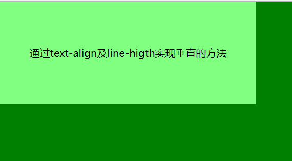
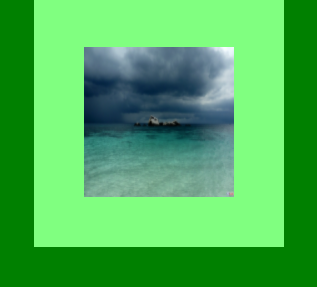
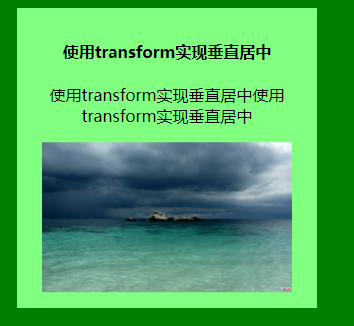
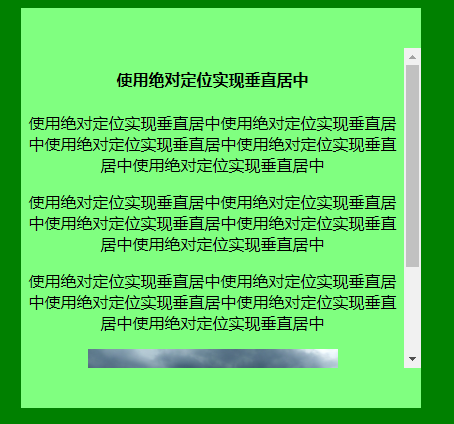
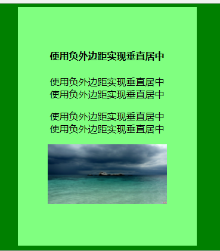
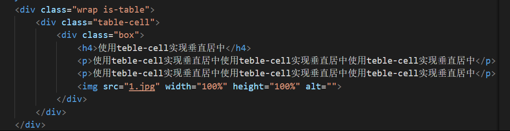
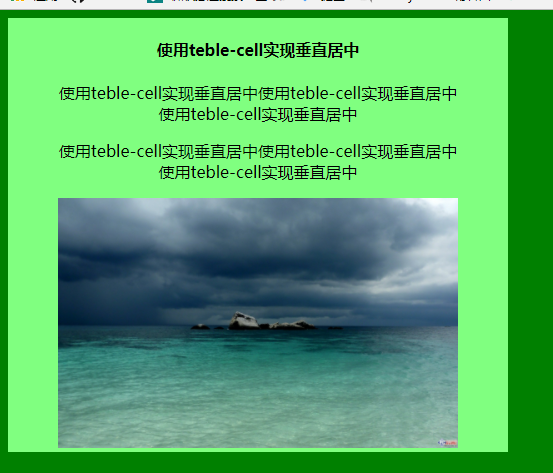
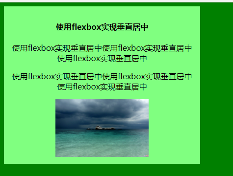

# CSS—总结常用垂直居中方法
### 1、text-align与line-hight方法实现居中
这是比较常用的方法。通过line-hight来设置行间距是实现垂直居中的关键
```
.wrap{
    width: 500px;
    heidth: 200px;
    line-height:200px;
    background: #80ff80;
    text-align:center;
    fontsize: 20px
}
```


### 2、利用padding和background-clip实现水平垂直居中
通过background-clip设置为center-box，将背景裁剪到内容区外沿，再利用padding设为外div减去内div的差的一一半来实现
```
.parent{
    margin: 0 auto;
    width: 250px;
    heidth: 250px;
    background: #80ff80;
}
.child img {
    width: 150px;
    heidth: 150px;
    padding 50px;
    background-clip: center-box;
}
```

### 3、使用transform实现垂直居中
其百分比计算不是以父元素为基准，而是以自己为基准，适用于没固定大小的内容，min-width、max-width、overflow：scroll等。使用这个属性时，不必定义子容器的高度，其会根据内容来自适应高度。但是IE8以下的浏览器不支持，而且属性需要写浏览器厂商的名字，还有可能会干扰其他transform的效果。  
```
.parent{ 
    width:300px;
    height: 300px; 
    margin: 0 auto;
    background: #89ff89; 
    position: relative;
} 
.child{ 
    position: absolute; 
    left: 50%; 
    top: 50%; 
    -webkit-transform：translate(-50%, -50%); 
    -ms-transform: translate(-50%, -50%); 
    transform: translate(-50%, -50%); 
    text-align: center
}
```


### 4、绝对居中实现垂直居中
这是一个兼容性比较好的能够实现垂直居中的方法。  
可以通过设置内容元素：`position: fixed`，`z-index: 999`成为视口居中，  
更改百分比宽高、最大最小宽度使其能够实现响应，  
只要 `margin:auto`，内容块将垂直居中，使用top、left、button、right可以设置偏移   
居中内容比父容器高时,加`overflow:auto`可防止内容溢出  
 但是唯一的确定就是父容器的高度必须是可知的。  
 ```
.parent{ 
    width:400px;
    min-height: 400px; 
    margin: 0 auto;
    background: #89ff89; 
    position: relative;
} 
.child{ 
    width:100%;
    height:80%;
    overflow:auto;
    margin:auto;
    position: absolute; 
    left: 0; 
    top: 0; 
    bottom: 0;
    right: 0; 
    text-align: center
}
```
 

### 5、负外边距实现垂直居中
这是比较流行的一种方法，当块元素尺寸已知，外边距margin取负数，大小为 **（width/heigth + pdding）/2**，加上top和left各为50%，这个方法兼容IE6以上的IE浏览器，代码量也比较少。但是不能自适应，不支持百分比尺寸和 **min-/max-** 属性设置，内容可能会溢出容器，需要计算margin的取值  
```
.child{ 
    width:200px;
    height:300px;
    padding:20px;
    position: absolute; 
    left: 50%; 
    top: 50%; 
    margin-left: -120px;
    margin-top: -170px;
    text-align: center
}
```


### 6、表单元（table-cell）实现垂直居中

其内容块高度可以随着实际内容的高度而变化，内容溢出时父元素会自己撑开，在浏览器中的兼容性也比较好，但是需要三层元素才能使最内层的元素居中   


```
.wrap .is-table {
    display: table;
}
.is-table .table-cell{
    display:table-cell;
    vertical-align: middle;
    max-width:500px;
    min-height: 400px;
    background: #0ff80
}
.table-cell .box{
    width: 80%;
    margin: 0 auto;
    text-align: center;000008
}
```


### 7、使用flexbox实现垂直居中
使用flexbox实现垂直居中很方便而且代码简洁， **align-items** 使元素水平居中，  **justify-content** 是元素垂直居中
但是其兼容性不是很好，对于IE只能兼容10以上，但是随着IE一些比较低的版本逐渐退出市场，flexbox的布局也将成为趋势 
``` 
.parent{ 
    display: flex;
    align-items: center;
    justify-content:center;
    width:400px;
    background: #89ff89; 
} 
.child{ 
    text-align: center;
    padding: 10px;
}
```  



