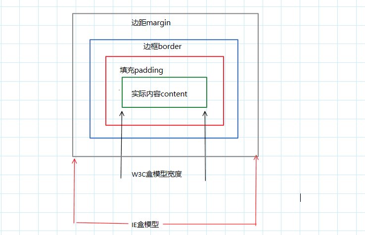

# CSS——盒子模型理解
1. 盒子模型作用：盒子模型就是一个盒子，封装周围的html元素。允许我们在其他元素和周围元素边框的空间放置元素。
2. 组成：  
外边距（margin）：相邻的两个盒子margin，会发生折叠，可为负数  
边框（border）：  
内边距（padding）：  
实际内容（content）：百分比相对于父容器的content box 的宽度，只有包含块的高度不依赖该元素时，百分比宽度才生效
3. 盒子模型图  

4. IE浏览器与标准浏览器下盒子模型的差异  
W3C盒模型：  
`width=content.width；heigth=content.heigth`  
IE盒模型：  
`width =content.width+border +margin；height=content.height+margin+border`  

CSS3引入box-sizing属性，可允许改变默认的css盒模型对元素宽高的计算方式
- **content-box:** 浏览器定义元素的屏幕宽度和高度的默认方法, 会将border宽度和padding厚度与width和height属性值相加,来确定该标签的屏幕高度和宽度
- **padding-box:** 当你在一个样式中设置了width和hight属性时,它应该包含padding作为该值的一部分
- **border-box:** 包含了border宽度和padding厚度,将它们作为width和height的一部分.
