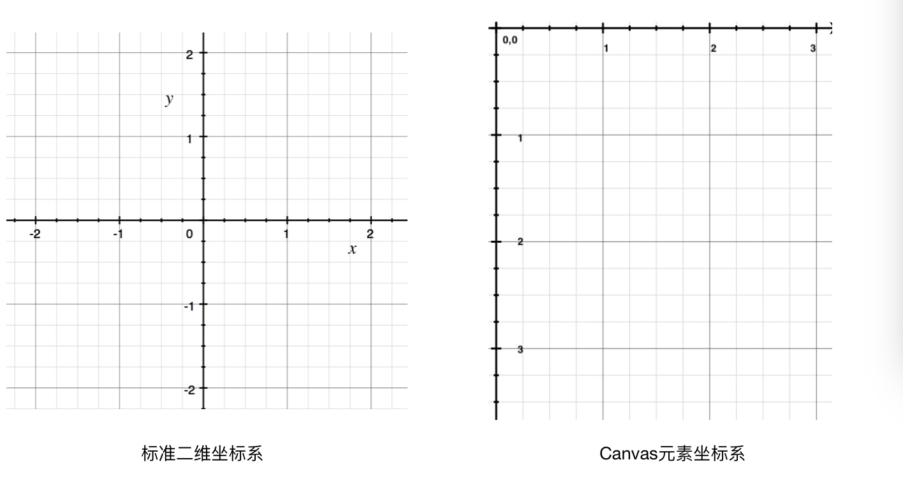
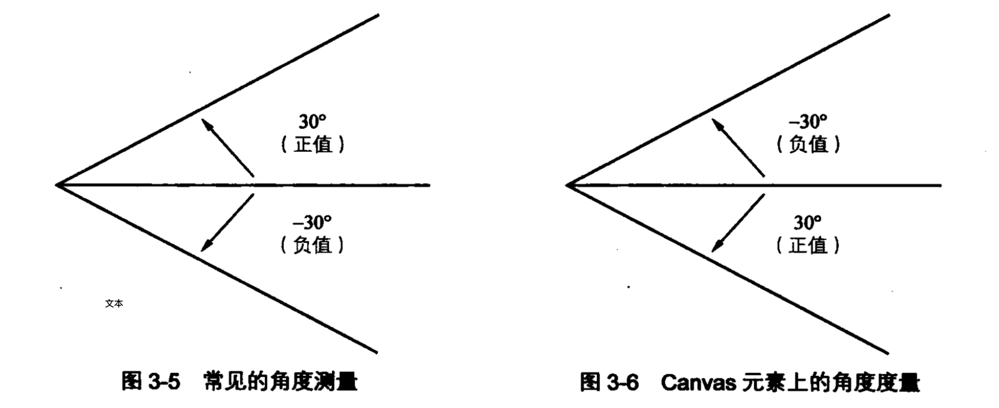
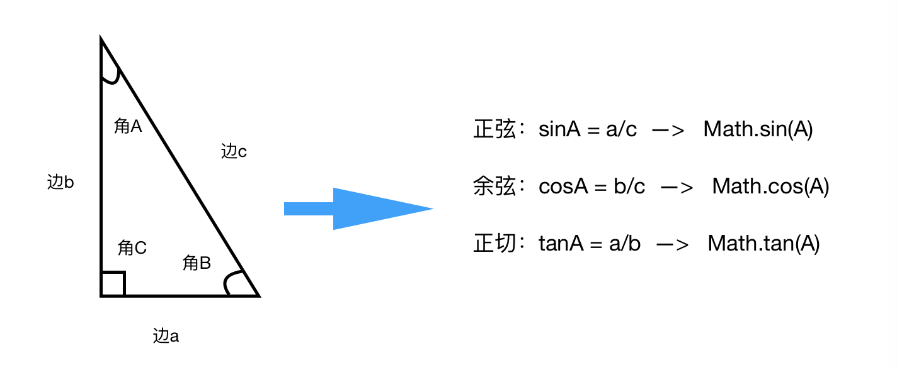
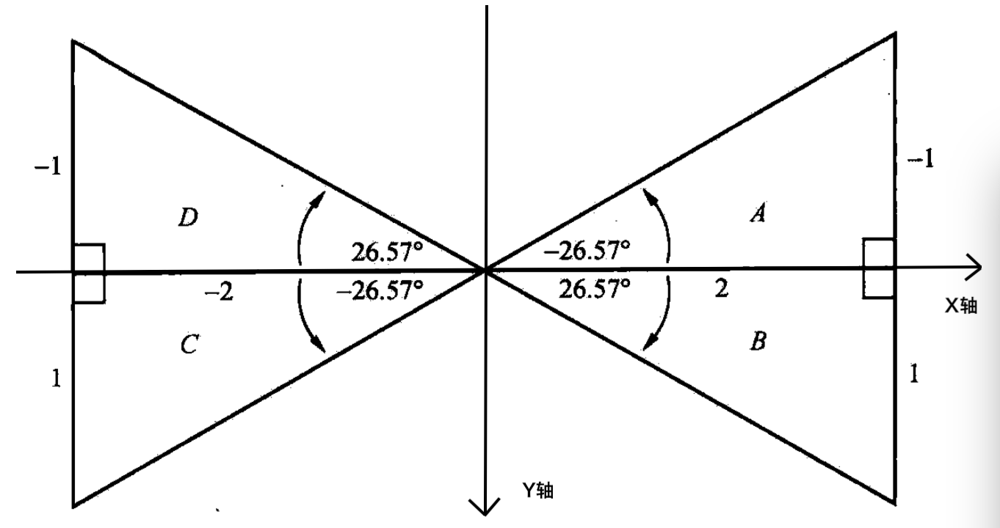
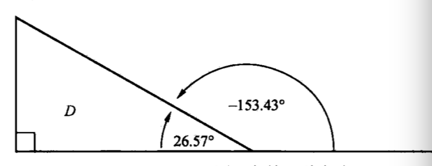

# 动画中的三角学

> - 三角学
> - 角
> - 三角函数
> - 旋转
> - 波形
> - 圆与椭圆
> - 勾股定理
> - 两点间距离

这是基于可视化的图形，大多数情况下，只需处理与位置、距离、以及相关的变量，主要使用到是的[Math 对象](https://developer.mozilla.org/zh-CN/docs/Web/JavaScript/Reference/Global_Objects/Math)

##### 一、三角形

- **概念**  
  在三角学中主要就是要了解三角形边和角之间的关系
- **弧度和角度**  
  角度和弧度是衡量角的一个度量单位， 在衡量角的大小的时候，计算机更情相依使用弧度的概念，其之间的关系及换算公式是：
  `180° = π`  
  `radians = degress * Math.PI / 180`  
  `degress = radians * 180 / Math.PI`
- **canvas**  
  最常见的  二维坐标系是以 x 轴为水平坐标，以 y 轴作为垂直坐标。  
  而 canvas 元素是基于视频画面的坐标系，其中(0,0)坐标会显示在空间的左上角，x 轴的坐标系还是从左往右不断增大，y 轴也是从下到  上不断增大，如图所示。
    
  然而 canvas 对于角度的测量也和常见的测量方式不一样。  
  在大多数系统中，角度测量是以逆时针方向为正值，二而 canvas 却刚好相反，顺时针的角度才是正值，逆时针的角度是负值。
  

##### 二、三角函数

- 正弦、余弦、正切
  在学习三角函数的时候我们做经常用到的是就是三角关系的计算，如正弦、余弦、正切 、余切等  
    
  在 JavaScript 中的 Math 内置对象就有提供相应的函数来计算这些三角关系， 但是如果只是要计算一个角 A，假设这个角 A 为 30°,其对边的长度 a=1，斜边的长度是 c=2，然后我们要计算其的正弦值，那么正常计算出来的  值`sinA = a/c = 1/2 = 0.5`，直接使用`Math.sin(30)`得出来的值却是`-0.9880316240928618`。  
  这是因为计算机  能够识别的是弧度，不是角度，所以在计算机中使用角度的时候都要将其转化为弧度，并且上面也提到了弧度  和角度之间的关系，那么通过角度和弧度的转化，我们得出来的能够被计算机  正确计算的三角关系的公式如下：

```
正弦：  sinA = a/c  ——>  Math.sin(A * Math.PI /180 )
余弦：  cosA = b/c  ——>  Math.cos(A * Math.PI /180 )
正切：  tanA = a/b  ——>  Math.tan(A * Math.PI /180 )
```

然而在 canvas 元素中，由于其角度测量的  方式和普通的  三角形的测量方式不一样，canvas 顺时针的值为正值，逆时针为负值，所以为了和普通三角函数的角度测量结果一样，我们在角度前面加一个负号即可。 

- 反正切  
  反正切其实就是  正切的逆运算，在 Math 对象中，对于反正切提供了两个方法如下：

```
Math.atan(A) * 180 / Math.PI
Math.atan2(y,x) * 180 / Math.PI
```

对于这两个公式用什么区别呢，让我们来看一下下图中在 canvas 坐标系中的四个角：A、B、C、D 分别在四个象限中。  
其四个角的正切值：

```
A:  -1 / 2 = -0.5 -> Math.atan(-0.5) * 180 / Math.PI
B:  1/2 = 0.5 -> Math.atan(0.5) * 180 / Math.PI,
C:  1/-2 = -0.5 -> Math.atan(-0.5) * 180 / Math.PI
C:  -1/-2 = 0.5 -> Math.atan(0.5) * 180 / Math.PI
```
  

通过 Math.atan(0.5)再将其转化为弧度，可以得倒一个接近 26.57° 的值，然而角 B 和角 D 的值时相同的，因此通过`Math.atan(radio)`无法分辨角 B 与角 D  
所以在 Math 对象中  存在着 Math.atan2(y,x)方法， 通过改方法，来看一下重新计算的 B 和 D

```
B: Math.atan2(1,2) ≈ 26.57°
D：Math.atan2(-1, -2) ≈ -153.43°
```
`Math.atan(radio)`计算角D，是通过canvas坐标系的x正轴开始以逆时针方向计算的，因此得到角D的角度为-153.43°
   
  
##### 三、例子：箭头跟着鼠标移动
