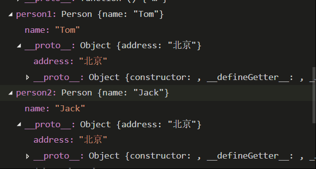
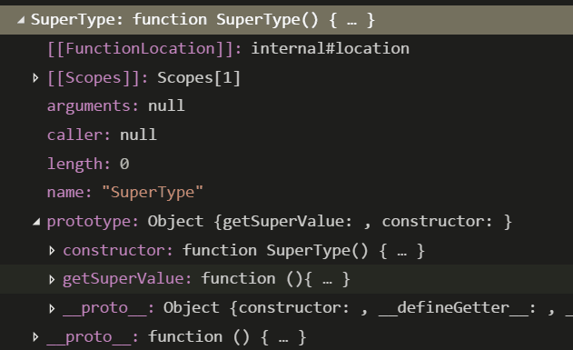
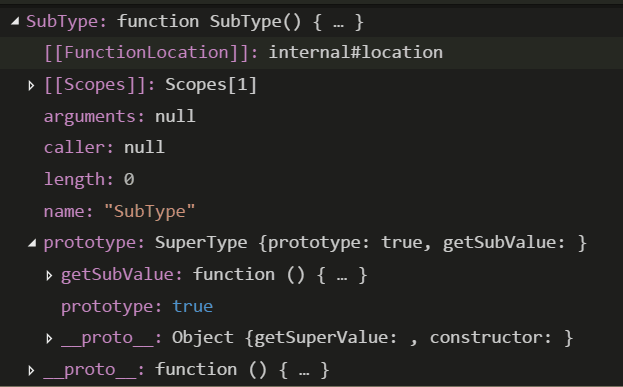
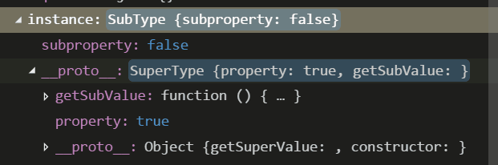

# 原型与原型链理解
### 1. 什么是原型  
JavaScript是一种简易的脚本语言，其是由对象构成。每一个JavaScript对象（除null外）都和另一个对象相关联，“另一个”对象就是原型。也就是说，任何一个对象都有原型这个属性。
    - 隐式原型（`_proto_`）：上面说的这个原型是JavaScript中的内置属性`[[prototype]]`，此属性继承自object对象，在脚本中没有标准的方式访问`[[prototype]]`，但Firefox、Safari和Chrome在每个对象上都支持一个属性`_proto_`。隐式原型的作用是用来构成原型链，实现基于原型的继承
    - 显示原型（prototype）：每一个函数在创建之后，便会拥有一个prototype属性，这个属性指向函数的原型对象。显示原型的作用是用来实现基于原型的继承与属性的共享
### 2. 那原型是用来做什么的？其可以解决什么问题？
- ##### 构造函数的缺陷：
    构造函数是通过new运算符创建并初始化一个新的对象，关键字new后跟随一个函数调用，这个函数称为构造函数，构造函数用来初始化一个新创建的对象。  
    现在有一个Person的构造函数，表示人对象的原型
    ```
    function Person(name) {
        this.name = name 
        this.address = "上海" // 设置一个实例对象的共有属性address
    }

    //生成人对象实例
    var person1 = new Person('Tom')
    var person2 = new Person('Jack')
    ```  
    这两个对象的address属性是独立的，修改其中一个，不会影响到另一个
    ```
    person1.address = "北京"
    console.log(person2.address) // 上海,不受person1的影响
    ```  
    每一个实例对象都有自己的属性和方法的副本，由于无法做到数据共享，导致资源的浪费。所以，为了解决数据无法共享的问题，引入了prototype属性，prototype属性是一个指针，指向一个对象，而这个对象的用途是包含可以由特定类型的所有实例共享的属性和方法，也就是说prototype是通过调用构造函数而创建的那个对象实例的原型对象。因此我们可以将实例对象需要共享的属性和方法都放在这个对象中。  
    现在对上面的Person方法进行重写，假设我们需要address这个属性是共享的，但是name是独有的。
    ```
    function Person(name) {
        this.name = name 
    }
    Person.prototype = {
        address: "上海"
    }

    //生成人对象实例
    var person1 = new Person('Tom')
    var person2 = new Person('Jack')

    //修改共享的属性address
    Person.prototype.address = "北京"
    console.log(person1.prototype) // 北京
    console.log(person2.prototype) // 北京
    ```  
      
    address属性放在了Person的prototype对象中，创建实例后，两个实例也将address属性放在了原型对象中，这两个实例对象共享这个属性，只要修改Person中的prototype对象，就会同时影响两个实例对象
-  ##### 继承机制  
    我们都知道JavaScript里面都是对象，如果想要让所有的对象联系起来，就需要有一种继承机制来实现。上面的例子中说了实例中原型的作用，就是实现共享属性和方法，但是如果想要让其他引用类型也共享这个引用类型的属性和方法呢？假如我们让原型对象等于另一个类型的实例，此时的原型对象将包含一个指向另一个原型的指针，相应地，另一个原型中也包含着一个指向另一个构造函数的指针。假如另一个原型又是另一个类型的实例，且关系依然成立，如此层层递进，就构成了实例与原型的链条。  
    实现原型链的基本模式  
    ```
    //原型链
    function SuperType() {
        this.property = true 
    }
    SuperType.prototype.getSuperValue = function(){
        return this.property
    }
    function SubType () {
        this.subproperty = false
    }
    //继承了SubType
    SubType.prototype = new SuperType()
    SubType.prototype.getSubValue = function () {
        return this.subproperty
    }
    var instance = new SubType()
    console.log(instance.getSuperValue())
    ```  
    首先先定义了两个类型：SuperType和SubType，每个类型分别有一个属性和方法，通过创建SuperType实例让SubType继承SuperType，并且将SuperType实例赋值给SubType.prototype。这样就将原来存放在SuperType的实例中的所有属性和方法共享到SubType.prototype中。  
    然后再给SubType.prototype添加一个方法，这样就在继承了SuperType的属性和方法的基础上又添加了一个新方法。
     
      
     
    最终结果如图上所示，instance指向SubType的原型，SubType的原型又指向SuperType的原型。getSuperValue()方法仍然还在SuperType.prototype中，但peoperty则位于SubType.prototype中。这是因为property是一个实例属性，而getSuperValue()这是一个原型方法。对于原型链的继承是如何进行的呢？  
    这就需要介绍一些原型搜索机制，原型搜索机制是当使用读取模式访问一个属性时，首先会在实例中搜索该属性，如果没有找到该属性，接着就会继续搜索实例的原型。 在通过原型链实现继承的情况下，搜索过程就得以沿着原型链继续向上。就拿上面的例子来说，调用instance.getSuperValue()会经历三个搜索步骤：  
        1). 搜索实例  
        2). 搜索SubTyp.prototype  
        3). 搜索SuperType.prototype，最后一步才会找到该方法  
        在找不到属性或方法的时的情况下，搜索过程总是要一环一环地前行到原型链的末端才会停下来。  
### 总结
JavaScript的原型是为了实现对象间的联系，解决构造函数无法数据共享而引入的一个属性。而原型链是一个实现对象间联系即继承的主要方法。
