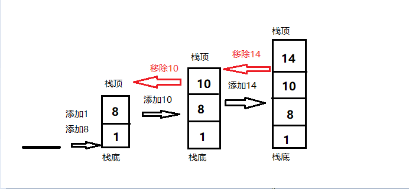

# JS实现入栈出栈  
### 1、什么是栈（原理+图）  
  栈是一种遵循 **后进先出（LIFO）** 原则的有序集合。新添加的或者待删除的元素都保存在栈的尾部（即栈顶），另一端叫栈底。在栈里，新元素都靠近栈顶，旧元素都接近栈底。    
### 2、实现入栈出栈的方法
方法一是创建一个Stack类来表示栈。具体代码如下：
```
function Stack() {
  var items = [];

  // 添加一个（或几个）新元素到栈顶
  this.push = function(ele) {
    items.push(ele);
  };
    
  // 移除栈顶的元素，同时返回被移除的元素
  this.pop = function() {
    return items.pop();
  };

  // 返回栈顶的元素，不对栈做任何修改
  this.peek = function() {
    return items[items.length - 1];
  };

  // 判断栈里使是否还有元素
  this.isEmpty = function() {
    return items.length == 0;
  };

  // 移除栈里所有的元素
  this.clear = function() {
    items = [];
  };

  // 返回栈里的元素个数
  this.size = function() {
    return items.length;
  };

  this.print = function() {
    console.log(items.toString());
  };
}
var stack = new Stack();
console.log(stack.isEmpty());
stack.push(1);
stack.push(8);
console.log(stack.peek());
stack.push(10);
console.log(stack.peek());
console.log(stack.size());
console.log(stack.isEmpty());
console.log(14)
stack.pop();
stack.pop();
stack.print();
```
通过测试来实现栈的操作：



另一种方式就是通过push将元素推入栈顶，然后遍历栈里的内容，删除栈顶元素，因为在栈顶元素被删除的时候，数组的长度是一直在变化的，所以要先将数组的长度赋值给len，来确保每次删除的是栈顶元素
```
function stack2 () {
    var arr = []
    for(let i = 0; i < 5; i ++){
        var temp = i + 1;
        arr.push(temp)
        console.log(temp + '入栈')
        console.log(arr)
    }
    console.log("arr内容:" + arr)
    var len = arr.length
    for(let i = 0; i < len; i++) {
        console.log("当前栈的长度：" + arr.length)
        console.log("删除栈顶元素：" + arr.pop())
    }
}
stack2()
```
### 3、入栈出栈的实际应用  
栈的实际应用之一就是实现十进制转化为任意进制  
以十进制转化为二进制为例：要把十进制转化成二进制，我们可以将十进制数字和2整除（二进制是蛮二进一），直到结果是0为止。其转化过程大致如下：
```
// 将十进制转为任意进制
function baseConerter(decNumber, base){
    var remStack = new Stack(),
        rem,
        baseString = '',
        digits = '0123456789ABCDEF'
    while (decNumber > 0) {
        rem = Math.floor(decNumber % base)
        remStack.push(rem)
        decNumber = Math.floor(decNumber / base)
    }
    while (!remStack.isEmpty()){
        baseString += digits[remStack.pop()]
    }
    console.log('baseString:' + baseString)
    return baseString
}
baseConerter(223411, 2)    // 110110100010110011
baseConerter(223411, 8)    // 664263
baseConerter(223411, 16)  // 368B3
```