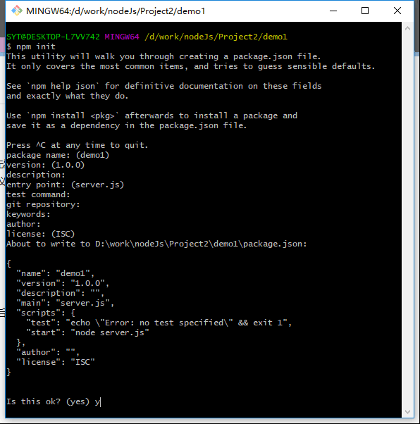
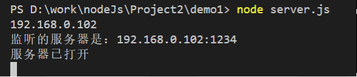
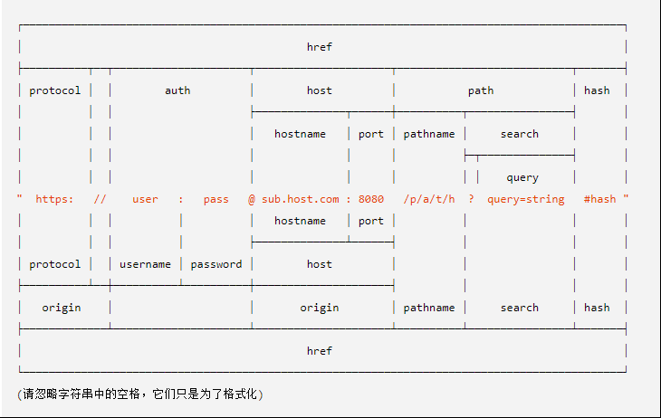
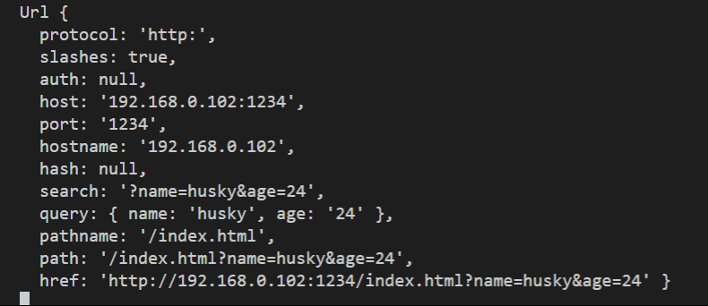
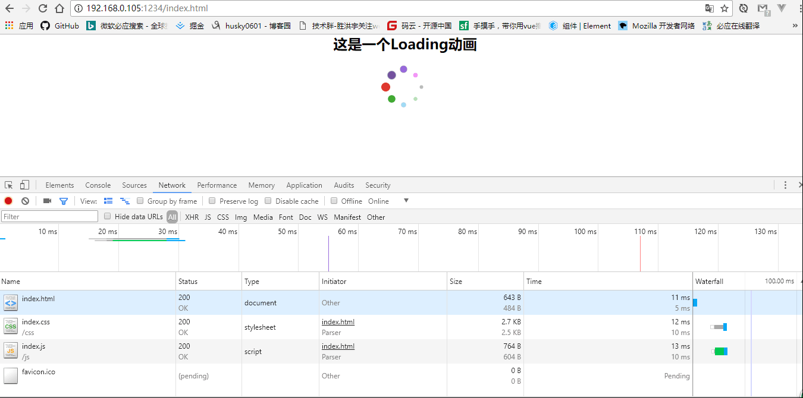

# node-静态资源文件请求
### 一、node环境的搭建  
1、在js的全栈开发中服务器端依赖于node环境，所以首先需要搭建一个node环境，才能够剑气我们的服务器。从官网上下载相应的安装包之后，直接安装即可（建议安装稳定版本），之后更新node可以直接使用命令行工具进行更新，但是在window系统下比较麻烦。  
2、创建一个node服务器项目，先创建一个项目文件，然后在文件夹中使用`npm  init`去初始化我们的项目，然后根据命令行的提示去描述我们的项目，最后输入 ‘yes’后会自动创建一个`package.json`的文件。这一步结束之后，node的环境算是搭建完成了，可以在官网上查看[node](http://nodejs.cn/api/)的文档来对node模块加深理解。  

### 二、node之http模块搭建服务  
1、首先在我们的定义的服务文件server.js中导入http、url、fs模块，
node中的http模块是专用于创建http服务器、http客户端，以及同时实现这些服务器端与客户端之中所有需求进行的所有处理  
2、定义一个变量来创建一个服务  
**```var server = http.CreateServer([requestListener]) ```** 
其中`requestListener`是一个函数，会被自动添加到‘request’事件，用户指定当接收到客户端请求时所需要执行的处理，该回调函数的指定方法如下  
**```function (request, response) {  … }```**  
在此回调函数中，使用两个参数，第一个参数是**request**是http的`IncomingMessage`对象，表示客户端请求， 第二个参数是**respons**是http的`ServerResponse`对象，表示服务端响应对象。  
3、服务器所要监听的地址及端口  
**```server.listen(port, [host],[backlog],[call])```**  
listen有四个参数，其中post是用于指定要监听的端口号，是必填的，当port的参数值为0时，将为http服务器分配一个随机端口号。其余三个参数为可选参数，host用于指定需要监听的地址，如果省略，服务器将监听localhost，backlog是一个整数值，用于指定位于等待队列中的客户端连接的最大数量，callback是一用来指定listening事件触发时调用的回调函数。  
```
var server = http.createServer(function(request, response) {
    console.log("服务器已打开") 
}
server.listen(1234, iptable["WLAN:1"], function() {
  console.log("监听的服务器是：" + iptable["WLAN:1"] + ":1234");
});
```  


### 三、node之url获取路径中的文件名称  
1、比如，我们有一个url地址是： `localhost:8080/index.html`  
index.html就是一个保存在我们本机上面的一个静态文件。
可以先通过node的url模块来获取到我们的路径名称里的文件名。
一个URL字符串是一个结构化的字符串对象，它包含多个有意义的组成部分。当被解析时，会返回一个url对象，它包含每个组成部分作为属性。下图是url的对象包含的属性  
  
url中有一个parse方法，就是能够将url地址进行解析  
**`Url.parse(url.String [, parseQuryString[, slashesDenoteHost]])`**  
第一个参数是urlString要解析的URL字符串，`parseQuryString`是一个布尔值，如果为true会将查询到的query返回解析成一个对象，`slashesDenoteHost`也是一个布尔值，如果为true的话则 `// `之后至下一个 `/ `之前的字符串会被解析作为 `host`。 例如，`//foo/bar` 会被解析为 `{host: 'foo', pathname: '/bar'}` 而不是 `{pathname: '//foo/bar'}`。 默认为 false。
这是通过本机获取到的url对象，url中包含：
```
protocal是一个协议l（http、https）
host为主机名+端口号
port为端口的名称
hash是哈希值
search是查询的参数并带有‘？’
query是查询到的参数
pathname是请求文件的路径及名称
path是请求文件的路径名称及查询的参数
href是一个完整的地址
```  
但是如果解析客户端请求的地址的时候，url是无法完全解析的，url只能解析一个完整的地址，还有一种可以解析完整的url就是使用express插件。  
  

### 四、node之fs模块获取文件
1、对于fs模块中获取文件地的主要方法是使用readFileSync和readFile，两个方法都需要传输路径和回调函数  
**`fs.readFile(path[.options],callback]`**   
异步获取文件方法，该方法立即返回操作结果，在使用同步方法执行的操作结束之前，不能执行后续的代码，在异步中还有一个传递编码格式的可选参数。  
**`fs.readFileSync(path, callback]`**  
同步获取文件方法，该方法将操作结果作为回调函数的参数进行返回，在方法调用之后，可以立即执行后续的代码
然后文件有许多的后缀，如html、css、js、png等等，这些文件类型在[MIME](http://www.w3school.com.cn/media/media_mimeref.asp)中可以查看。

```
// 通过异步方法获取文件
    fs.readFile('.'+pathname, 'utf8',function(err, data){
        if(err) {
            response.writeHead(
                404,
                {'Content-Type': 'text/plain'}
            )
            console.log("require file is not find")
        } else{
            response.writeHead(
                200,
                {'Content-Type': suffixMIME + ';charset=utf-8'}
            )
            response.end(data)
        }
    })
```  
启动node，在浏览器地址中输入ip+端口+文件名，效果如图所示  


