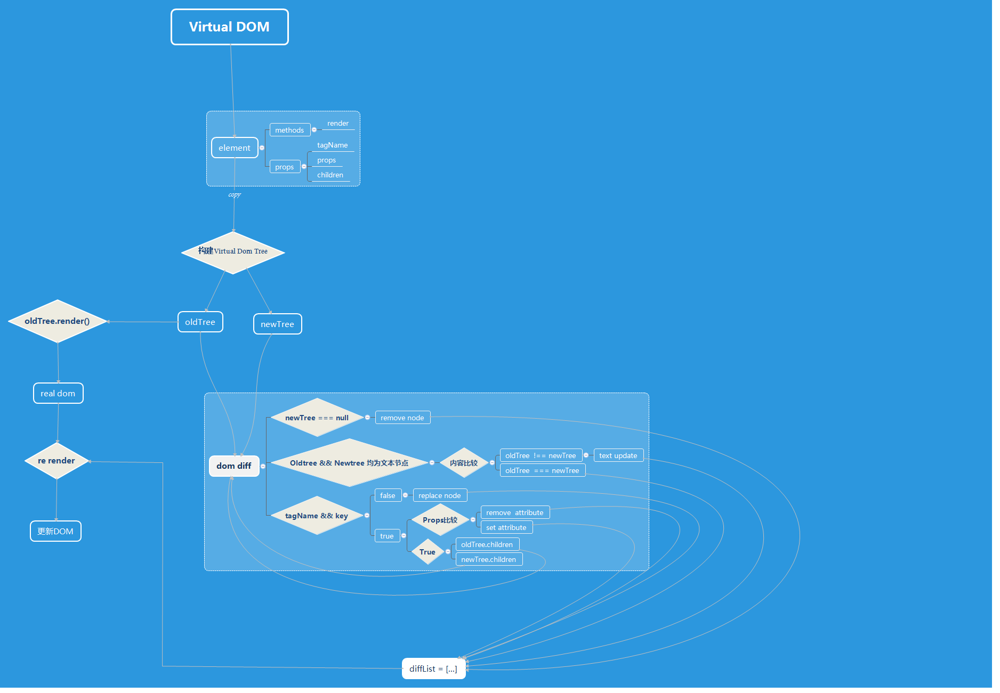
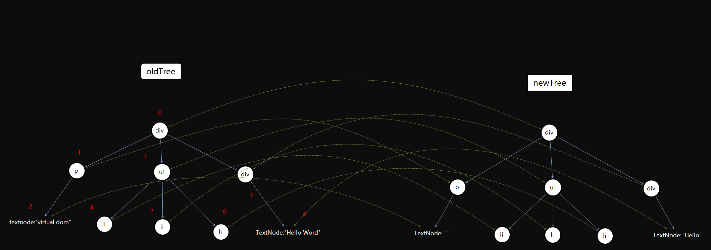
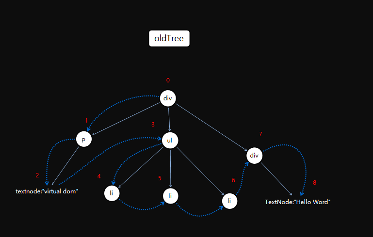

# React Virtual DOM  
### 一、概念  
- 在react中，对于每个DOM对象都有一个相应的“虚拟DOM对象”，相当于DOM对象的轻量级副本 
- 由于是Virtual DOM只是一个副本，具有与真实的DOM对象相同的属性，但是无法直接更改浏览器屏幕上内容的真实功能  
- 当直接操作DOM时涉及到直接更改页面，所有操作DOM会比较慢，正因为操作Virtual DOM不会直接改变真实的DOM，所以操作Virtual DOM速度会更快。

### 二、原理  
每个Virtual DOM都有两个DOM Tree，一个是新的，一个是原来的。当Virtual DOM更新后，React会将Virtual DOM与更新前获取的Virtual DOM进行比较（这个过程叫做“差异化”，是整个实现Virtual DOM更新的核心），但获取到了变化的Virtual DOM对象之后，React就可以直接在真实的DOM更新这些对象，并且只更新更改的对象。  

### 三、实现过程  
  

### 四、算法的理解与实现  
    
- Virtual DOM本质上就是在JS和DOM之间做了一个缓存。JS只操作Virtual DOM，最后的时候把变更的内容写入到DOM  
- Virtual DOM算法包括几个步骤：  
    **1、用JavaScript对象结构表示DOM树的结构**    
    - 记录节点的类型、属性和子节点，将其转化成具有相同属性（`tagName=''`、`props={}`、`children=[]`和`key=''`），并且对每个节点进行标记  
    - 对于Element创建一个原型链render()方法，用于渲染oldTree
    **2、比较两棵Virtual DOM的差异**  
    
    - 记录差异类型    
    - 通过采用深度优先遍历来标识每一个节点，深度优先遍历本质是通过循环递归创建栈  
    - 当替换当前节点或子节点或文本，新增、删除子节点或文本以及对节点重新排序等，可以通过定义几种差异类型来对virtual DOM的差异进行判断  
    
    - 列表对比算法，当知道了新旧tree的顺序，这主要是要去解决字符串的最小编辑距离问题，一般采用动态规划来求解。

    **3、将差异的应用到真正的DOM树上**   
    - 对真实DOM上的树进行深度优先遍历，在所有的差异列表中找出当前遍历的节点差异，然后根据不同进行操作。比如说，如果其差异类型是替换节点，可通过DOM节点的`parentNode.replaceChild()`的方法进行替换；如果是排序的话，通过动态规划的方法将其DOM上的元素进行排列；如果有子节点的话，将其设置与真实DOM上相同的属性，然后插入；如果是文本的话还需对浏览器做兼容处理，在IE浏览器上文本是放在`node.nodeValue`, 其他标准浏览器都是放在`node.textContent`

### 五、参考资料   
[理解 Virtual DOM](https://github.com/y8n/blog/issues/5)  
[深度剖析：如何实现一个 Virtual DOM 算法](https://github.com/livoras/blog/issues/13)  
[Virtual DOM实现代码](https://github.com/Matt-Esch/virtual-dom)
