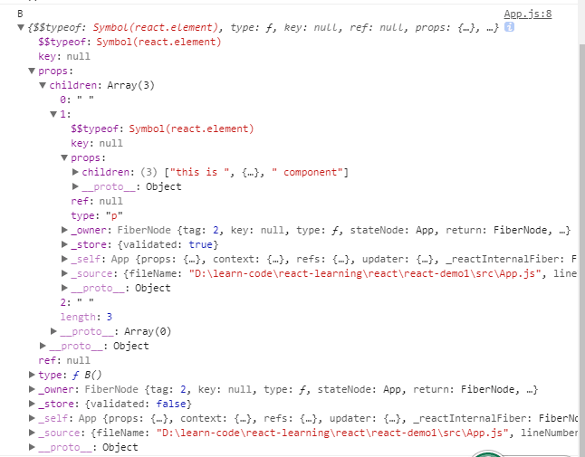

# React源码解析之组件的实现与挂载  
### 1、组件是什么    
> Component是一个类/函数？  
> 构建一个Component并console.log    
```
<B> <p>This is <strong>B</strong> component <p> </B>
```
  
组件B打印出来是一个对象，而组件中的element都被包含在了childdren属性中，存储为一个DOM节点树