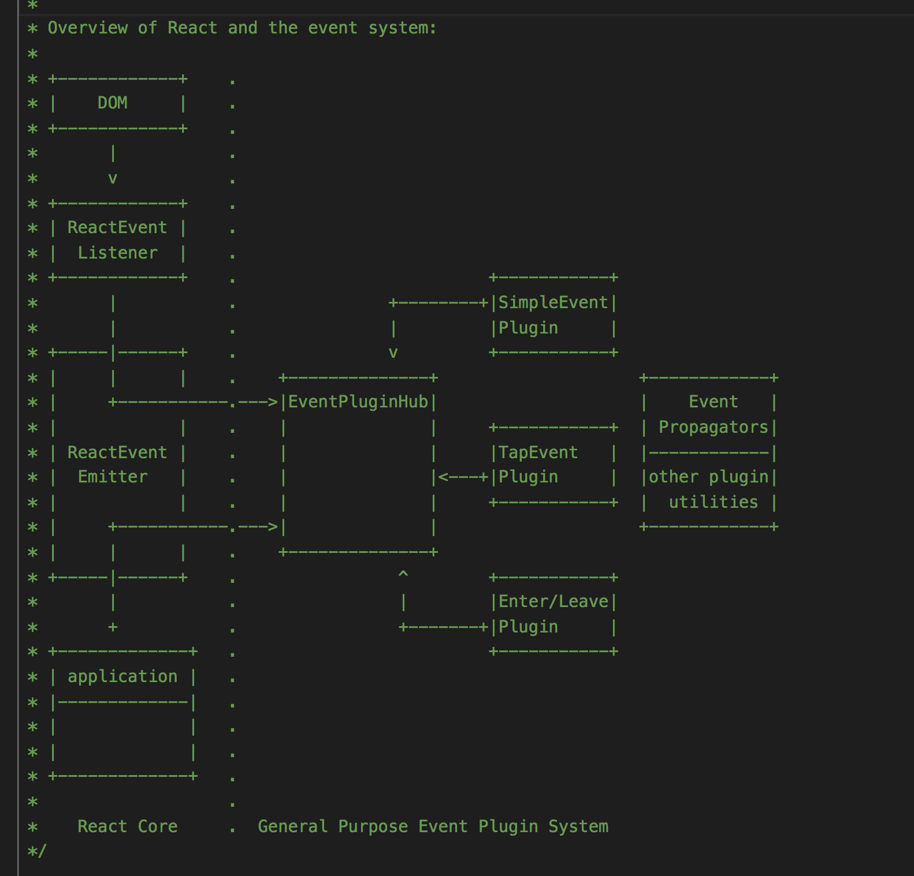

# 理解React事件处理机制


#### 一、原生JS的事件绑定与React的事件绑定
- 原生事件
在原生事件中，如果想要监听按钮的点击事件，我们通常会在相应的DOM上绑定事件和对应的回调函数即可，形式如下，但是如果当页面变得复杂且事件处理频率高的话，那么网页的性能就会下降
```
<button onclick="handleClick()"> Click me</button>
```
- React事件  
在React的事件系统中，只是通过了SyntheticEvent对原生的事件系统进行了封装，所有的事件处理器都会经过一个对原生事件包装的跨域浏览器的SyntheticEvent的实例，将所有的事件都绑定在网页上的document，然后通过统一的事件监听器进行处理和分发，找到对应的回调函数并执行。

#### 二、SyntheticEvent事件合成过程     
先来看一下React事件处理机制的流程图   
   

1、**事件的注册**      
在React中，最简单的，当我们要触发一个事件的时候，就会在其DOM绑定事件：   
```
<button onClick={this.handleClick}> Click me </button>
```  
- `enqueuePutListener`   
在ReactDOMComponent文件中的mountComponent函数中会执行一个`_updateDOMProperties`方法，该方法中主要是通过`enqueuePutListener` 方法去注册事件   
```
function enqueuePutListener(inst, registrationName, listener, transaction) {
  if (transaction instanceof ReactServerRenderingTransaction) return
  var containerInfo = inst._hostContainerInfo;
  var isDocumentFragment = containerInfo._node && containerInfo._node.nodeType === DOC_FRAGMENT_TYPE;
  
  //找到真实DOM
  var doc = isDocumentFragment? containerInfo._node : containerInfo._ownerDocument;  
  
  // 调用listenTo方法注册
  listenTo(registrationName, doc); 

  // 进入事务队列
  transaction.getReactMountReady().enqueue(putListener, {  
    inst: inst,
    registrationName: registrationName,
    listener: listener,
  });
}
```
- `trapBubbledEvent`、
- `trapCapturedEvent`  
在`listenTo`的方法中使用到了处理事件捕获与事件冒泡的函数,在`trapBubbledEvent`与`trapCapturedEvent`事件中在有元素的情况下使用了`dispatchEvent`事件方法，在这个方法中我们看到了其使用了`addEventListener`、`removeEventListener`这两个对原生`addEventListener`、`removeEventListener`的监听事件的封装。通过事件的统一绑定可以减少内存的开销，提升了性能。   
```
trapBubbledEvent: function(topLevelType, handlerBaseName, element) {
  if (!element) {
    return null;
  }
  return EventListener.listen(
    element,
    handlerBaseName,
    ReactEventListener.dispatchEvent.bind(null, topLevelType),
  );
},

dispatchEvent: function(event) {
  var nativeEvent = unwrap(event);
  var eventType = nativeEvent.type;
  handledEventsTable.set(nativeEvent, false);
  scope.renderAllPending();
  var tempListener;
  if (!hasListenerInAncestors(this, eventType)) {
    tempListener = function() {};
    this.addEventListener(eventType, tempListener, true);
  }
  try {
    return unwrap(this).dispatchEvent_(nativeEvent);
  } finally {
    if (tempListener) this.removeEventListener(eventType, tempListener, true);
  }
}

function addEventListener(node, eventName, eventListener) {
  node.addEventListener(eventName, eventListener, false);
}

function removeEventListener(node, eventName, eventListener) {
  node.removeEventListener(eventName, eventListener, false);
}
```

2、**事件存储**     
有上图可知，在事件处理完监听与注册之后，接下来要执行`EventPluginHub`函数，该方法主要用来处理事件的存储，以便触发时进行回调。在`EventPluginHub`中主要是通过`EventPluginHub.putListener`函数进行存储，在该方法中所有的回调函数都是以二维数组的形式存储在`listenerBank`中，根据组件对应的`key`来进行管理   
```
putListener: function(inst, registrationName, listener) {
  var key = getDictionaryKey(inst);
  var bankForRegistrationName =
    listenerBank[registrationName] || (listenerBank[registrationName] = {});
  bankForRegistrationName[key] = listener;

  var PluginModule =
    EventPluginRegistry.registrationNameModules[registrationName];
  if (PluginModule && PluginModule.didPutListener) {
    PluginModule.didPutListener(inst, registrationName, listener);
  }
}
```
3、**事件分发**   

- `handleTopLevelImpl`  
在事件处理完了之后，要对事件进行分发，也就是上图流程图中的`Event Propagators`，在React中分发的入口在`ReactEventListener.js`的`handleTopLevelImpl`，由于事件的回调函数执行后可能会导致DOM结构的变化，那么React先将当前的结构以数组的形式存储起来然后一次遍历执行。
```
function handleTopLevelImpl(bookKeeping) {
  var nativeEventTarget = getEventTarget(bookKeeping.nativeEvent);
  // 寻找事件触发的DOM
  var targetInst = ReactDOMComponentTree.getClosestInstanceFromNode(nativeEventTarget,);
  var ancestor = targetInst;
  //在执行之前，先存储事件触发瞬间的DOM结构，记为ancestors数组
  do {
    bookKeeping.ancestors.push(ancestor);
    ancestor = ancestor && findParent(ancestor);
  } while (ancestor);

  // 依次遍历数组，并执行回掉函数，是所谓的冒泡
  for (var i = 0; i < bookKeeping.ancestors.length; i++) {
    targetInst = bookKeeping.ancestors[i];
    ReactEventListener._handleTopLevel(
      bookKeeping.topLevelType,
      targetInst,
      bookKeeping.nativeEvent,
      getEventTarget(bookKeeping.nativeEvent),
    );
  }
}
```     
- `handleTopLevel` 
在上述的函数`_handleTopLevel`最终对回调函数进行处理，通过`EventPluginHub`函数中的`extractEvents`合成事件对不同的事件类型合成不同的跨浏览器的`SyntheticEvent`对象的实例。
```
handleTopLevel: function(topLevelType,targetInst,nativeEvent,nativeEventTarget,) {
  var events = EventPluginHub.extractEvents(topLevelType,targetInst,nativeEvent,nativeEventTarget,);
  runEventQueueInBatch(events);
},
```
在`EventPluginHub.injectEventPluginsByName`中可以看到对于不同的事件，React将使用不同的功能插件，这些插件都是通过依赖注入的方式进入内部使用的。React合成事件的过程非常繁琐，但可以概括出`extractEvents`函数内部主要通过switch函数区分事件类型并调用不同的插件进行处理从而生成`SyntheticEvent`实例。
```
ReactInjection.EventPluginHub.injectEventPluginsByName({
  SimpleEventPlugin: SimpleEventPlugin,
  EnterLeaveEventPlugin: EnterLeaveEventPlugin,
  ChangeEventPlugin: ChangeEventPlugin,
  SelectEventPlugin: SelectEventPlugin,
  BeforeInputEventPlugin: BeforeInputEventPlugin,
});
```

4、**事件处理**  
- `runEventQueueInBatch`  
对于事件处理的方法，React采取的策略与处理setState的方法时类似的，都是采用批策略处理的方法。在上面的`handleTopLevel`方法中的最后调用了`runEventQueueInBatch`方法   
```
function runEventQueueInBatch(events) {
  // 事件进入队列
  EventPluginHub.enqueueEvents(events);
  // 进程事件队列
  EventPluginHub.processEventQueue(false);
}
```   
- `processEventQueue`  
进程事件队列主要是调度事件队列中的所有合成队列
```
processEventQueue: function(simulated) {
  var processingEventQueue = eventQueue;
  if (simulated) {
    forEachAccumulated(processingEventQueue,executeDispatchesAndReleaseSimulated);
  } else {
    forEachAccumulated(processingEventQueue,executeDispatchesAndReleaseTopLevel);
  }
},

```  
- `executeDispatchesAndRelease`
在进程事件队列中不论是在`executeDispatchesAndReleaseSimulated`方法中还是在`executeDispatchesAndReleaseTopLevel`方法中都使用到了`executeDispatchesAndRelease`
在此方法中判断了当前事件是否是持久的，如果不是，那么调度事件并将其释放回池中，这样便可减少内存的开销。
```
var executeDispatchesAndReleaseSimulated = function(e) {
  return executeDispatchesAndRelease(e, true);
};
var executeDispatchesAndReleaseTopLevel = function(e) {
  return executeDispatchesAndRelease(e, false);
};

var executeDispatchesAndRelease = function(event, simulated) {
  if (event) {
    EventPluginUtils.executeDispatchesInOrder(event, simulated);

    if (!event.isPersistent()) {
      event.constructor.release(event);
    }
  }
};
```  

- `executeDispatchesInOrder`      
事件处理的核心入口在`executeDispatchesInOrder`方法中，该方法主要通过事件的收集调度进行标准/简单迭代。  


```
function executeDispatchesInOrder(event, simulated) {
  var dispatchListeners = event._dispatchListeners;
  var dispatchInstances = event._dispatchInstances;

  if (Array.isArray(dispatchListeners)) {
    for (var i = 0; i < dispatchListeners.length; i++) {
      if (event.isPropagationStopped()) {
        break;
      }
      executeDispatch(
        event,
        simulated,
        dispatchListeners[i],
        dispatchInstances[i],
      );
    }
  } else if (dispatchListeners) {
    executeDispatch(event, simulated, dispatchListeners, dispatchInstances);
  }
  event._dispatchListeners = null;
  event._dispatchInstances = null;
}
```

- `executeDispatch` 
可以看到，在下列代码中执行了`executeDispatch`方法，该方法的主要目的是将事件发送给监听器，其中`dispatchListeners`是事件的回调函数， `dispatchInstances`是对应的组件
```
function executeDispatch(event, simulated, listener, inst) {
  var type = event.type || 'unknown-event';
  event.currentTarget = EventPluginUtils.getNodeFromInstance(inst);
  if (simulated) {
    ReactErrorUtils.invokeGuardedCallbackWithCatch(type, listener, event);
  } else {
    ReactErrorUtils.invokeGuardedCallback(type, listener, event);
  }
  event.currentTarget = null;
}
``` 
- `invokeGuardedCallback`  
而在`invokeGuardedCallback`中就相当简单了，就是调用一个函数，其中`func(a)`就是`listener(event)`,这就是React事件监听事件并且通过拿到原生事件后进行回调。
```
function invokeGuardedCallback<A>(name: string,func: (a: A) => void,a: A): void {
  try {
    func(a);
  } catch (x) {
    if (caughtError === null) {
      caughtError = x;
    }
  }
}
```

#### 三、总结  
在React事件系统中，并不是直接操作原生事件，而是将所有的事件进行封装，这个封装叫做事件的合成(`SyntheticEvent`)，通过事件注册、存储、分发和处理对事件进行统一而不是分散的存储和管理，捕获事件后内部生成合成事件来提高浏览器的兼容性，执行回调函数后再进行销毁释放内存，从而大大提高网页的响应性能。