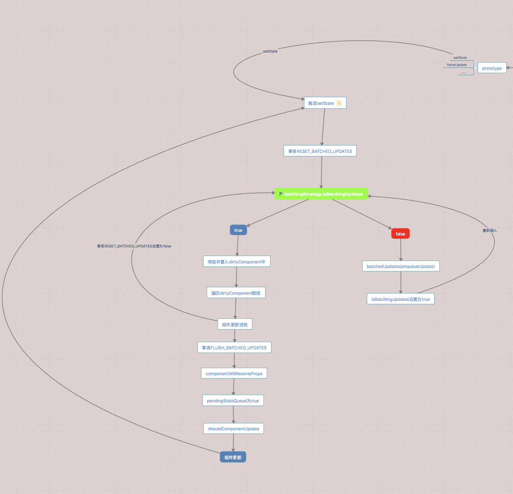

# 理解React事务与更新队列     

> **什么是事务，什么是队列**   
1、事务：  
    在计算机中事务的概念主要来源于数据库，是数据库管理系统执行过程中的一个逻辑单位，由一个有限的数据库操作序列构成。  
    数据库事务通常包含了一个序列的对数据库的读/写操作。  
    其具有原子性、一致性、隔离性和持久性  
2、队列  
    是先进先出（FIFO）的线性表，通常用链表或者数组来实现。   
    队列只允许在后段进行插入操作，在前端进行删除操作  
    队列一般的形式有单链队列、循环队列以及阵列队列   


在自定义组件中，当我们要更新一个or多个state中的值时，我们会通过`this.setState`进行调用，而更新的过程中会需要了解事务机制和更新队列,接下来就来了解一下React是如何更新state。

**1、`this.setState`**    

在React组件中定义的setState方法，该方法传入了两个参数`partialState`为新的state值和`callback`回调函数

```
ReactComponent.prototype.setState = function(partialState, callback) {
  this.updater.enqueueSetState(this, partialState);
  if (callback) {
    this.updater.enqueueCallback(this, callback, 'setState');
  }
};
```
在该方法中，调用了的`update`则是在React的构造函数中定义的。在自定义组件的挂在函数中通过`getUpdateQueue()`方法获取到需要的`updateQueue`最后通过`_constructComponentWithoutOwnerfunction`方法调用构造函数并且传出`updateQueue`,而`updateQueue`就是对应构造函数的参数`update`
```
function ReactComponent(props, context, updater) {
  this.props = props;
  this.context = context;
  this.refs = emptyObject;
  this.updater = updater || ReactNoopUpdateQueue;
}

_constructComponentWithoutOwnerfunction(doConstruct,publicProps,publicContext,updateQueue) {
    var Component = this._currentElement.type;
    return new Component(publicProps, publicContext, updateQueue);
}
```


- `enqueueSetState`  
`enqueueSetState`这是一个设置`state`的子集，在这个函数中提供了一种合并策略，但是这种合并策略部适用于深层属性。  
在这个函数中接收两个参数：  
`publicInstance`：需要被重新渲染的实例即当前组件   
`partialState`:要与state合并的下一个部分state    
`getInternalInstanceReadyForUpdate`方法是获取当前组件对象并将其赋值给`internalInstance`变量。如果当前`internalInstance`存在需要更新的state队列，则将`partialState`加入当前队列，如果不存在，则创建该对象的更新队列，然后调用`enqueueUpdate`
```
enqueueSetState: function(publicInstance, partialState) {
    var internalInstance = getInternalInstanceReadyForUpdate(publicInstance,'setState');

    if (!internalInstance)return;

    var queue =internalInstance._pendingStateQueue ||(internalInstance._pendingStateQueue = []);
    queue.push(partialState);

    enqueueUpdate(internalInstance);
},
```

- `enqueueUpdate`
在`enqueueUpdate`方法中通过判断`batchingStrategy.isBatchingUpdates`来执行不同的方法，如果为true就执行`batchingStrategy.batchedUpdates`方法，
否则将当前组件放入`dirtyComponents`中
```
function enqueueUpdate(component) {
  if (!batchingStrategy.isBatchingUpdates) {
    batchingStrategy.batchedUpdates(enqueueUpdate, component);
    return;
  }

  dirtyComponents.push(component);
}
```  


- `ReactDefaultBatchingStrategy`
在 `ReactDefaultBatchingStrategy`对象中主要有两个属性，一个是`isBatchingUpdates`用来判断是否批量更新，其初始值为`false`，另一个是`batchedUpdates`方法，该方法内部用来执行传入的回调函数

```
var ReactDefaultBatchingStrategy = {
  isBatchingUpdates: false, // 是否处在第一次BatchingUpdates标识位

  batchedUpdates: function(callback, a, b, c, d, e) {
    var alreadyBatchingUpdates = ReactDefaultBatchingStrategy.isBatchingUpdates;

    ReactDefaultBatchingStrategy.isBatchingUpdates = true; // 

    if (alreadyBatchingUpdates) {
      return callback(a, b, c, d, e);
    } else {
      return transaction.perform(callback, null, a, b, c, d, e);
    }
  },
};
```
我们都知道，在更新组件流程中，React是以事务+状态的形式对组件进行更新。在执行更新组件的过程中，react是通过状态的判断来执行的，在最后的`batchedUpdates`方法中，在通过判断`alreadyBatchingUpdates`的状态来执行`transaction`，`transaction`就是在react更新机制中的事务。


**2、`transaction`事务处理**  
在官方源码中介绍了transaction的主要作用：transaction创建了一个可以包裹任何方法的盒子，下图中的`perform`就是用来包裹任何方法的方法，`initialize`是在调用包裹方法前的初始化方法，该方法会返回任何预计算，`close`则是包裹方法后执行的关闭方法
```
 <pre>
                       wrappers (injected at creation time)
                                      +        +
                                      |        |
                    +-----------------|--------|--------------+
                    |                 v        |              |
                    |      +---------------+   |              |
                    |   +--|    wrapper1   |---|----+         |
                    |   |  +---------------+   v    |         |
                    |   |          +-------------+  |         |
                    |   |     +----|   wrapper2  |--------+   |
                    |   |     |    +-------------+  |     |   |
                    |   |     |                     |     |   |
                    |   v     v                     v     v   | wrapper
                    | +---+ +---+   +---------+   +---+ +---+ | invariants
 perform(anyMethod) | |   | |   |   |         |   |   | |   | | maintained
 +----------------->|-|---|-|---|-->|anyMethod|---|---|-|---|-|-------->
                    | |   | |   |   |         |   |   | |   | |
                    | |   | |   |   |         |   |   | |   | |
                    | |   | |   |   |         |   |   | |   | |
                    | +---+ +---+   +---------+   +---+ +---+ |
                    |  initialize                    close    |
                    +-----------------------------------------+
 </pre>
```

在前面提到的`batchedUpdates`方法中最后调用了`transaction.perform(callback)`，但在调用这个事务类之前，在包裹的方法之外定义了两个对象，`RESET_BATCHED_UPDATES`， `FLUSH_BATCHED_UPDATES`，这个两个对象中都定义了包裹方法前的`initialize`和`close`属性方法，然后创建了一个初始化的方法并作为`ReactDefaultBatchingStrategyTransaction`的原型链，然后重新实例化`transaction`
- `RESET_BATCHED_UPDATES`   
  其作用是设置`isBatchingUpdates`也就是组件更新状态的值，组件有更新要求的话则设置为更新状态true，更新结束后重新恢复原状态，这样可避免组件的重复渲染，提升性能。

```
var RESET_BATCHED_UPDATES = {
  initialize: emptyFunction,
  close: function() {
    ReactDefaultBatchingStrategy.isBatchingUpdates = false;
  },
};

var FLUSH_BATCHED_UPDATES = {
  initialize: emptyFunction,
  close: ReactUpdates.flushBatchedUpdates.bind(ReactUpdates),
};

var TRANSACTION_WRAPPERS = [FLUSH_BATCHED_UPDATES, RESET_BATCHED_UPDATES];

Object.assign(ReactDefaultBatchingStrategyTransaction.prototype, Transaction, {
  getTransactionWrappers: function() {
    return TRANSACTION_WRAPPERS;
  },
});

var transaction = new ReactDefaultBatchingStrategyTransaction();
```

在`ReactDefaultBatchingStrategy`对象中，`isBatchingUpdates`初始值为`false`，当以事务地形式执行`transaction.perform(callback)`（方法中的`callback`就是`enqueueUpdate`）时，实际的执行流程如下：  
```
// RESET_BATCHED_UPDATES.initialize()   emptyFunction
// enqueueUpdate()
// RESET_BATCHED_UPDATES.close()
```

- `FLUSH_BATCHED_UPDATES`   
`FLUSH_BATCHED_UPDATES`的主要作用是更新组件，在`FLUSH_BATCHED_UPDATES.close()`的逻辑中使用while遍历所有的`dirtyComponents`，然后又通过事务的形式调用`runBatchedUpdates`，在`runBatchedUpdates`中主要做了两件事：  
1、通过执行`updateComponent`方法来更新组件   
2、如果`setState`方法传入了回调函数则将回调函数存入`callbackQueue`队列

```
var flushBatchedUpdates = function() {
  while (dirtyComponents.length || asapEnqueued) {
    if (dirtyComponents.length) {
      var transaction = ReactUpdatesFlushTransaction.getPooled();
      transaction.perform(runBatchedUpdates, null, transaction);
      ReactUpdatesFlushTransaction.release(transaction);
    }
  }
};

function runBatchedUpdates(transaction) {
  var len = transaction.dirtyComponentsLength;
  dirtyComponents.sort(mountOrderComparator);
  updateBatchNumber++;

  for (var i = 0; i < len; i++) {
    var component = dirtyComponents[i];
    var callbacks = component._pendingCallbacks;
    component._pendingCallbacks = null;

    var markerName;
    if (ReactFeatureFlags.logTopLevelRenders) {
      var namedComponent = component;
      if (component._currentElement.type.isReactTopLevelWrapper) {
        namedComponent = component._renderedComponent;
      }
      markerName = 'React update: ' + namedComponent.getName();
      console.time(markerName);
    }

    ReactReconciler.performUpdateIfNecessary(component,transaction.reconcileTransaction,updateBatchNumber);

    if (markerName) {
      console.timeEnd(markerName);
    }

    if (callbacks) {
      for (var j = 0; j < callbacks.length; j++) {
        transaction.callbackQueue.enqueue(
          callbacks[j],
          component.getPublicInstance(),
        );
      }
    }
  }
}
```   


- `updateComponent`
```
  updateComponent: function(transaction,prevParentElement,nextParentElement,prevUnmaskedContext,nextUnmaskedContext){
    // ...

    if (willReceive && inst.componentWillReceiveProps) {
      inst.componentWillReceiveProps(nextProps, nextContext);
    }

    var nextState = this._processPendingState(nextProps, nextContext);

    var shouldUpdate = true;
    if (!this._pendingForceUpdate) {
      if (inst.shouldComponentUpdate) {
        shouldUpdate = inst.shouldComponentUpdate(nextProps, nextState,nextContext,);
      } else {
        if (this._compositeType === CompositeTypes.PureClass) {
          shouldUpdate =!shallowEqual(prevProps, nextProps) ||!shallowEqual(inst.state, nextState);
        }
      }
    }

    // 根据shouldUpdate的值判断是否要进行渲染
    this._updateBatchNumber = null;
    if (shouldUpdate) {
      this._pendingForceUpdate = false;
      this._performComponentUpdate(
        nextParentElement,
        nextProps,
        nextState,
        nextContext,
        transaction,
        nextUnmaskedContext,
      );
    } else {
      this._currentElement = nextParentElement;
      this._context = nextUnmaskedContext;
      inst.props = nextProps;
      inst.state = nextState;
      inst.context = nextContext;
    }

  }
```   

- `_processPendingState`
在updateComponent源码中可以看到，在判断是否需要`shouldComponentUpdate`之前，对将要渲染的nextState通过`_processPendingState`方法进行处理进行合并处理。该方法主要对state做了一下几件事  
1、如果不存在更新队列，则返回原来的state   
2、如果使用pendingReplaceState（将当前的state替换）或者更新队列只有一个数据，则返回更新值   
3、如果更新队列有多个更新，则通过for循环将其合并  

```
_processPendingState: function(props, context) {
    var inst = this._instance;
    var queue = this._pendingStateQueue;
    var replace = this._pendingReplaceState;
    this._pendingReplaceState = false;
    this._pendingStateQueue = null;

    if (!queue) {
      return inst.state;
    }

    if (replace && queue.length === 1) {
      return queue[0];
    }

    var nextState = Object.assign({}, replace ? queue[0] : inst.state);
    for (var i = replace ? 1 : 0; i < queue.length; i++) {
      var partial = queue[i];
      Object.assign(
        nextState,
        typeof partial === 'function'
          ? partial.call(inst, nextState, props, context)
          : partial,
      );
    }

    return nextState;
  },
```   

- `_performComponentUpdate`  
在`shouldUpdate`为true的时候，执行`_performComponentUpdate`，而该方法主要是判断当前的实例中是否执行了`componentDidUpdate`方法以此来获取旧的state和props和将要渲染的state和props赋值给当前的组件，然后执行了`_updateRenderedComponent`方法

```
_performComponentUpdate: function(nextElement,nextProps,nextState,nextContext,transaction,unmaskedContext) {
  var inst = this._instance;

  var hasComponentDidUpdate = Boolean(inst.componentDidUpdate);
  var prevProps;
  var prevState;
  var prevContext;
  if (hasComponentDidUpdate) {
    prevProps = inst.props;
    prevState = inst.state;
    prevContext = inst.context;
  }

  if (inst.componentWillUpdate) {
    inst.componentWillUpdate(nextProps, nextState, nextContext);
  }

  this._currentElement = nextElement;
  this._context = unmaskedContext;
  inst.props = nextProps;
  inst.state = nextState;
  inst.context = nextContext;

  this._updateRenderedComponent(transaction, unmaskedContext);
  if (hasComponentDidUpdate) {
    transaction.getReactMountReady().enqueue(inst.componentDidUpdate.bind(inst,prevProps,prevState,prevContext),inst);
  }
}
```  

- `_updateRenderedComponent`
该函数先获取新旧组件的信息，然后通过`shouldUpdateReactComponent`方法判断新旧元素是否要更新，如果函数返回true，则执行旧组件的更新，否则就执行旧组件的卸载和新组件的挂载
```
  _updateRenderedComponent: function(transaction, context) {
    var prevComponentInstance = this._renderedComponent;
    var prevRenderedElement = prevComponentInstance._currentElement;
    var nextRenderedElement = this._renderValidatedComponent();
    var debugID = 0;

    if (shouldUpdateReactComponent(prevRenderedElement, nextRenderedElement)) {
      ReactReconciler.receiveComponent(
        prevComponentInstance,
        nextRenderedElement,
        transaction,
        this._processChildContext(context),
      );
    } else {
      var oldHostNode = ReactReconciler.getHostNode(prevComponentInstance);
      ReactReconciler.unmountComponent(prevComponentInstance, false);

      var nodeType = ReactNodeTypes.getType(nextRenderedElement);
      this._renderedNodeType = nodeType;
      var child = this._instantiateReactComponent(
        nextRenderedElement,
        nodeType !== ReactNodeTypes.EMPTY ,
      );
      this._renderedComponent = child;

      var nextMarkup = ReactReconciler.mountComponent(
        child,
        transaction,
        this._hostParent,
        this._hostContainerInfo,
        this._processChildContext(context),
        debugID,
      );

      this._replaceNodeWithMarkup(
        oldHostNode,
        nextMarkup,
        prevComponentInstance,
      );
    }
  },
```

综上，在整个更新的大致流程如下：
  
  


- **总结**  
在React中自定义的组件中的state的更新方法是通过事务（transitio）+ 队列（queue）的方法进行更新的，事务主要用来判断state的更新状态，而队列则是一种合并策略，将这两种方式结合起来更新state，可以实现多state的更新，并且避免重复渲染，很好得提升了react的性能。