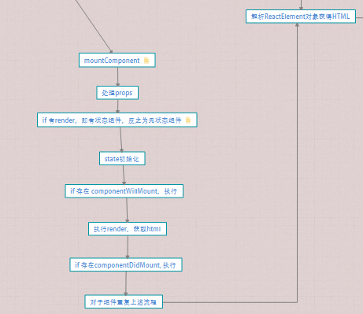

# 理解 React 组件生命周期

### 组件类型

在 ReactDOM.render()的时候会根据传入的参数类型，在`instantiateReactComponent`方法中进行输出四种不同的组件

- ReactEmptyComponent: (react-15-stable/src/renderers/shared/ReactDOMEmptyComponent.js)
- ReactTextComponent:(react-15-stable/src/renderers/shared/ReactDOMTextComponent.js)
- ReactDOMComponent:(react-15-stable/src/renderers/shared/ReactDOMEmptyComponent.js)
- ReactCompositeComponent:(react-15-stable/src/renderers/shared/stack/reconciler/ReactCompositeComponent.js)

**1、ReactEmptyComponent**  
ReactEmptyComponent 通过 create()方法创建，并最终调用 ReactDOMEmptyComponent 方法。因为该方法渲染出一个空组件，所以插入到真实 DOM 中也为空

```
// create 创建空组件
var ReactEmptyComponent = {
  create: function(instantiate) {
    return emptyComponentFactory(instantiate);
  },
};
// 将空组件注入
ReactEmptyComponent.injection.injectEmptyComponentFactory(EmptyComponent);

// 渲染空组件
var ReactDOMEmptyComponent = function(instantiate) {
  this._currentElement = null;
  this._hostNode = null;
  this._hostParent = null;
  this._hostContainerInfo = null;
  this._domID = 0;
};
Object.assign(ReactDOMEmptyComponent.prototype, {
  mountComponent: function(
    transaction,
    hostParent,
    hostContainerInfo,
    context,
  ) {
    var domID = hostContainerInfo._idCounter++;
    this._domID = domID;
    this._hostParent = hostParent;
    this._hostContainerInfo = hostContainerInfo;

    var nodeValue = ' react-empty: ' + this._domID + ' ';
    if (transaction.useCreateElement) {
      var ownerDocument = hostContainerInfo._ownerDocument;
      var node = ownerDocument.createComment(nodeValue);
      ReactDOMComponentTree.precacheNode(this, node);
      return DOMLazyTree(node);
    } else {
      if (transaction.renderToStaticMarkup) {
        return '';
      }
      return '<!--' + nodeValue + '-->';
    }
  },
  receiveComponent: function() {},
  getHostNode: function() {
    return ReactDOMComponentTree.getNodeFromInstance(this);
  },
  unmountComponent: function() {
    ReactDOMComponentTree.uncacheNode(this);
  },
});

module.exports = ReactDOMEmptyComponent;
```

**2、ReactTextComponent**
ReactTextComponent是通过`ReactHostComponent.createInstanceForText()`方法创建的。其处理逻辑与操作`ReactEmptyComponent`相似，但是在挂载流程中判断其没有标签，就会通过`escapeTextContentForBrowser`方法对参数进行空格的校验处理，最终以简单的' '+参数方法将参数转化为字符串并返回。
```
mountComponent: function(transaction,hostParent,hostContainerInfo,context) {
  var domID = hostContainerInfo._idCounter++;
  var openingValue = ' react-text: ' + domID + ' ';
  var closingValue = ' /react-text ';
  this._domID = domID;
  this._hostParent = hostParent;
  if (transaction.useCreateElement) {
    var ownerDocument = hostContainerInfo._ownerDocument;
    var openingComment = ownerDocument.createComment(openingValue);
    var closingComment = ownerDocument.createComment(closingValue);
    var lazyTree = DOMLazyTree(ownerDocument.createDocumentFragment());
    DOMLazyTree.queueChild(lazyTree, DOMLazyTree(openingComment));
    if (this._stringText) {
      DOMLazyTree.queueChild(
        lazyTree,
        DOMLazyTree(ownerDocument.createTextNode(this._stringText)),
      );
    }
    DOMLazyTree.queueChild(lazyTree, DOMLazyTree(closingComment));
    ReactDOMComponentTree.precacheNode(this, openingComment);
    this._closingComment = closingComment;
    return lazyTree;
  } else {
    var escapedText = escapeTextContentForBrowser(this._stringText);

    if (transaction.renderToStaticMarkup) {
      // Normally we'd wrap this between comment nodes for the reasons stated
      // above, but since this is a situation where React won't take over
      // (static pages), we can simply return the text as it is.
      return escapedText;
    }

    return (
      '<!--' +
      openingValue +
      '-->' +
      escapedText +
      '<!--' +
      closingValue +
      '-->'
    );
  }
}
```

**3、ReactDOMComponent**
该组件是通过reacthHostComponent.createInternalComponent()方法创建，其处理流程与上述两类组件基本相同，由于dom元素同样没有生命周期，ReactDOMComponent会对传入的标签通过`switch`方式进行识别和处理。
```
mountComponent: function(transaction,hostParent,hostContainerInfo,context) {
    this._rootNodeID = globalIdCounter++;
    this._domID = hostContainerInfo._idCounter++;
    this._hostParent = hostParent;
    this._hostContainerInfo = hostContainerInfo;

    var props = this._currentElement.props;

    switch (this._tag) {
      case 'audio':
      case 'form':
      case 'iframe':
      case 'img':
      case 'link':
      case 'object':
      case 'source':
      case 'video':
        // ...
        break;
    }

    if (transaction.useCreateElement) {
      var ownerDocument = hostContainerInfo._ownerDocument;
      var el;
      if (namespaceURI === DOMNamespaces.html) {
        if (this._tag === 'script') {
          var div = ownerDocument.createElement('div');
          var type = this._currentElement.type;
          div.innerHTML = `<${type}></${type}>`;
          el = div.removeChild(div.firstChild);
        } else if (props.is) {
          el = ownerDocument.createElement(this._currentElement.type, props.is);
        } else {
          el = ownerDocument.createElement(this._currentElement.type);
        }
      } else {
        el = ownerDocument.createElementNS(
          namespaceURI,
          this._currentElement.type,
        );
      }

}
```

**4、ReactCompositeComponent**  
自定义组件是通过 ReactCompositeComponentWrapper()创建,生命周期的实现流程是在 ReactCompositeComponent()方法中实现的。
在这部分主要是去理解组件的挂载(mountComponent)、更新(updateComponent)及销毁(unmountComponent)的流程即在这些函数中主要做了哪些事情

- `mountComponent`：  
在生命周期的创建阶段，mountComponent 主要是先处理 props、判断当前组件是有状态组件还是无状态组件并进行相应的处理、处理 state、如果存在 componentWillMound 即执行，执行 render 获取 HTML，如果存在 componentDidMount 即执行，对于子组件也重复上述操作,主要的流程图和代码如下：
  

```
  // 生命周期之挂载组件
  mountComponent:mountComponent: function(transaction,hostParent,hostContainerInfo,context){
    this._context = context;
    this._mountOrder = nextMountID++;
    this._hostParent = hostParent;
    this._hostContainerInfo = hostContainerInfo;

    // 处理props，只在开发阶段使用
    var publicProps = this._currentElement.props;
    var publicContext = this._processContext(context);
    var Component = this._currentElement.type;
    var updateQueue = transaction.getUpdateQueue();

    // 初始化公共类
    var doConstruct = shouldConstruct(Component);
    var inst = this._constructComponent(doConstruct,publicProps,publicContext,updateQueue,);
    var renderedElement;

    //判断当前组件是有状态组件还是无状态组件，判断依据是inst or inst.render为空
    if (!doConstruct && (inst == null || inst.render == null)) {
      renderedElement = inst;
      warnIfInvalidElement(Component, renderedElement);
      inst = new StatelessComponent(Component);
    }else {
      if (isPureComponent(Component)) {
        this._compositeType = CompositeTypes.PureClass;
      } else {
        this._compositeType = CompositeTypes.ImpureClass;
      }
    }

    // 设置变量
    inst.props = publicProps;
    inst.context = publicContext;
    inst.refs = emptyObject;
    inst.updater = updateQueue;
    this._instance = inst;

    // 存储实例对象的引用到map中，便于查找
    ReactInstanceMap.set(inst, this);

    // 初始化state、队列等
    var initialState = inst.state;
    if (initialState === undefined) {
      inst.state = initialState = null;
    }
    this._pendingStateQueue = null;
    this._pendingReplaceState = false;
    this._pendingForceUpdate = false;

     var markup;
    if (inst.unstable_handleError) {
      // 处理挂载时出错，然后调用performInitialMount方法，初始化挂载
      markup = this.performInitialMountWithErrorHandling(renderedElement,hostParent,hostContainerInfo,transaction,context,);
    } else {
      // 初始化挂载
      markup = this.performInitialMount(renderedElement,hostParent,hostContainerInfo,transaction,context,);
    }

    if (inst.componentDidMount) {
      // 调用componentDidMount，以事务的形式
      transaction.getReactMountReady().enqueue(() => {
        measureLifeCyclePerf(
          () => inst.componentDidMount(),
          this._debugID,
          'componentDidMount',
        );
      });
    }

    return markup;
  }
  // 生命周期之更新组件

  // 生命周期之销毁组件
```

在挂载的时候是通过`performInitialMount`进行处理的，在方法中主要会对判断是否需要调用`componentWillMount`和对`setState`中的数据进行重新渲染, 根据当前渲染的组件是否有无状态，得到需要渲染的`renderedElement`后进行判断该渲染的元素的组件类型，对其及其子组件进行渲染

```
performInitialMount: function(renderedElement,hostParent,hostContainerInfo,transaction,context){
  var inst = this._instance;
  if (inst.componentWillMount) {
    inst.componentWillMount();
    //当在挂载时，componentWillMount中调用setState不会重新render，而是做一次state合并
    if (this._pendingStateQueue) {
      inst.state = this._processPendingState(inst.props, inst.context);
    }
  }

  // 如果是无状态组件，直接渲染
  if (renderedElement === undefined) {
    renderedElement = this._renderValidatedComponent();
  }

  // 获取到组件类型，根据组件类型的不同进行渲染，并且渲染其子组件
  var nodeType = ReactNodeTypes.getType(renderedElement);
  this._renderedNodeType = nodeType;
  var child = this._instantiateReactComponent(renderedElement,nodeType !== ReactNodeTypes.EMPTY );
  this._renderedComponent = child;
  var markup = ReactReconciler.mountComponent(child,transaction,hostParent,hostContainerInfo,this._processChildContext(context),debugID);
}
```

- `updateComponent`:   
在组件生命周期的中，对于已经挂载的组件，要对其进行更新，主要是在 `setState()`中实现，但是在这里需要先了解一下`componentWillReceiveProps`、`shouldComponentUpdate`和`componentWillUpdate`是如何对组件进行更新的。  
在`updateComponent`中，先调用`componentWillReceiveProps`，然后合并`setState`导致的`state`变化。然后调用`shouldComponentUpdate`判断是否需要更新渲染。

```
  updateComponent: function(transaction,prevParentElement,nextParentElement,prevUnmaskedContext,nextUnmaskedContext){
    var inst = this._instance;
    var willReceive = false;
    var nextContext;

    // 判断context对象时候有改动，如果有则检查propTypes等,这在开发阶段可以报错提醒
    if (this._context === nextUnmaskedContext) {
      nextContext = inst.context;
    } else {
      nextContext = this._processContext(nextUnmaskedContext);
      willReceive = true;
    }

    var prevProps = prevParentElement.props;
    var nextProps = nextParentElement.props;

    if (prevParentElement !== nextParentElement) {
      willReceive = true;
    }

    // 调用componentWillReceiveProps,如果通过setState进入的updateComponent，则没有这一步
    if (willReceive && inst.componentWillReceiveProps) {
      inst.componentWillReceiveProps(nextProps, nextContext);
    }

    // 提前合并state，`componentWillReceiveProps`中调用setState不会重新渲染，
    var nextState = this._processPendingState(nextProps, nextContext);

    // 如果调用`shouldComponentUpdate`并且给shouldUpdate赋值
    var shouldUpdate = true;
    if (!this._pendingForceUpdate) {
      if (inst.shouldComponentUpdate) {
        shouldUpdate = inst.shouldComponentUpdate(nextProps, nextState,nextContext,);
      } else {
        if (this._compositeType === CompositeTypes.PureClass) {
          shouldUpdate =!shallowEqual(prevProps, nextProps) ||!shallowEqual(inst.state, nextState);
        }
      }
    }

    // 根据shouldUpdate的值判断是否要进行渲染
    this._updateBatchNumber = null;
    if (shouldUpdate) {
      this._pendingForceUpdate = false;
      this._performComponentUpdate(
        nextParentElement,
        nextProps,
        nextState,
        nextContext,
        transaction,
        nextUnmaskedContext,
      );
    } else {
      this._currentElement = nextParentElement;
      this._context = nextUnmaskedContext;
      inst.props = nextProps;
      inst.state = nextState;
      inst.context = nextContext;
    }

  }
```
- `performComponentUpdate`: 
当需要更新当前组件的时候，调用了`performComponentUpdate`方法，后在调用`updateRenderedComponent`进行更新渲染，最后调用`componentDidUpdate`
```
_performComponentUpdate: function(nextElement,nextProps, nextState,nextContext,transaction,unmaskedContext){
  var inst = this._instance;

  //判断是否已经update了
  var hasComponentDidUpdate = Boolean(inst.componentDidUpdate);
  var prevProps;
  var prevState;
  var prevContext;
  if (hasComponentDidUpdate) {
    prevProps = inst.props;
    prevState = inst.state;
    prevContext = inst.context;
  }

  // 渲染前调用componentWillUpdate
  if (inst.componentWillUpdate) {
    inst.componentWillUpdate(nextProps, nextState, nextContext);
  }

  //设置组件的state、props等属性
  this._currentElement = nextElement;
  this._context = unmaskedContext;
  inst.props = nextProps;
  inst.state = nextState;
  inst.context = nextContext;

  //内部会调用render方法，重新解析ReactElement并得到HTML
  this._updateRenderedComponent(transaction, unmaskedContext);

  // render后调用componentDidUpdate
  if (hasComponentDidUpdate) {
    transaction.getReactMountReady().enqueue(inst.componentDidUpdate.bind(inst,prevProps,prevState, prevContext),inst);
  }
}
```  

- `updateRenderedComponent`:
`updateRenderedComponen`t会调用`renderValidatedComponent`内部的`render`方法，得到`ReactElement`，然后再判断是否需要做DOM diff计算，如果前后元素有发生变化，会递归`shouldUpdateReactComponent`,更新子组件的虚拟DOM，否则就将组件卸载后再重新挂载，重新渲染

```
_updateRenderedComponent: function(transaction, context){
  var prevComponentInstance = this._renderedComponent;
  var prevRenderedElement = prevComponentInstance._currentElement;

  // _renderValidatedComponent内部会调用render，得到ReactElement
  var nextRenderedElement = this._renderValidatedComponent();

  var debugID = 0;
  debugID = this._debugID;

  // 判断是否做DOM diff
  if (shouldUpdateReactComponent(prevRenderedElement, nextRenderedElement)) {
    //递归shouldUpdateReactComponent， 更新子组件的virtual DOM
    ReactReconciler.receiveComponent(prevComponentInstance,nextRenderedElement,transaction,this._processChildContext(context));
  } else {
    // 不做DOM diff则先unmountComponent，再加载
    var oldHostNode = ReactReconciler.getHostNode(prevComponentInstance);
    ReactReconciler.unmountComponent(prevComponentInstance, false);

    //重新挂载组件，得到相对应的HTML
    var nodeType = ReactNodeTypes.getType(nextRenderedElement);
    this._renderedNodeType = nodeType;
    var child = this._instantiateReactComponent(nextRenderedElement,nodeType !== ReactNodeTypes.EMPTY);
    this._renderedComponent = child;

    var nextMarkup = ReactReconciler.mountComponent(child,transaction,this._hostParent,this._hostContainerInfo,this._processChildContext(context),debugID,);

    if (debugID !== 0) {
      var childDebugIDs = child._debugID !== 0 ? [child._debugID] : [];
      ReactInstrumentation.debugTool.onSetChildren(debugID, childDebugIDs);
    }

    //将HTML加入DOM中
    this._replaceNodeWithMarkup(oldHostNode,nextMarkup,prevComponentInstance,);
  }
}

_renderValidatedComponent: function() {
  var renderedElement;
  if (this._compositeType !== CompositeTypes.StatelessFunctional) {
    ReactCurrentOwner.current = this;
    try {
      renderedElement = this._renderValidatedComponentWithoutOwnerOrContext();
    } finally {
      ReactCurrentOwner.current = null;
    }
  } else {
    renderedElement = this._renderValidatedComponentWithoutOwnerOrContext();
  }

  return renderedElement;
}

 _renderValidatedComponentWithoutOwnerOrContext: function() {
    var inst = this._instance;
    var renderedElement;
    renderedElement = inst.render();
    return renderedElement;
  },

```  

- `unmountComponent`:  
在组件生命周期的最后一个阶段就是销毁组件，和mountComponent的一样，不同的type的ReactComponent也会欧不同的unmountComponent行为，在这里需要去分析自定义组件下是如何销毁组件的。  
在unmountComponent方法中主要做了实现了：  
  1、调用componentWillUnmount  
  2、递归调用了unmountComponent方法来销毁子组件  
  3、将内部的变量置空，以此来防止内存泄漏

```
unmountComponent: function(safely) {
  if (!this._renderedComponent)  return;
  var inst = this._instance;

  // 调用componentWillUnmount
  if (inst.componentWillUnmount && !inst._calledComponentWillUnmount) {
    inst._calledComponentWillUnmount = true;

    if (safely) {
      var name = this.getName() + '.componentWillUnmount()';
      ReactErrorUtils.invokeGuardedCallback(
        name,
        inst.componentWillUnmount.bind(inst),
      );
    } else {
      inst.componentWillUnmount();
    }
  }


  //  递归调用unmountComponent来销毁子组件
  if (this._renderedComponent) {
    ReactReconciler.unmountComponent(this._renderedComponent, safely);
    this._renderedNodeType = null;
    this._renderedComponent = null;
    this._instance = null;
  }

  // Reset 等待队列和其他状态等待
  this._pendingStateQueue = null;
  this._pendingReplaceState = false;
  this._pendingForceUpdate = false;
  this._pendingCallbacks = null;
  this._pendingElement = null;

  // reset内部变量，防止内存泄漏
  this._context = null;
  this._rootNodeID = 0;
  this._topLevelWrapper = null;

  // 将组件移除
  ReactInstanceMap.remove(inst);
},
```
