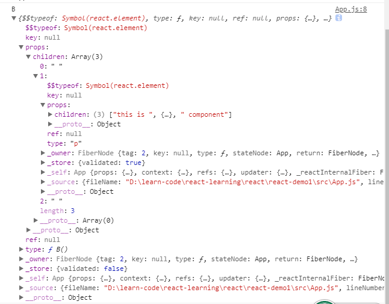
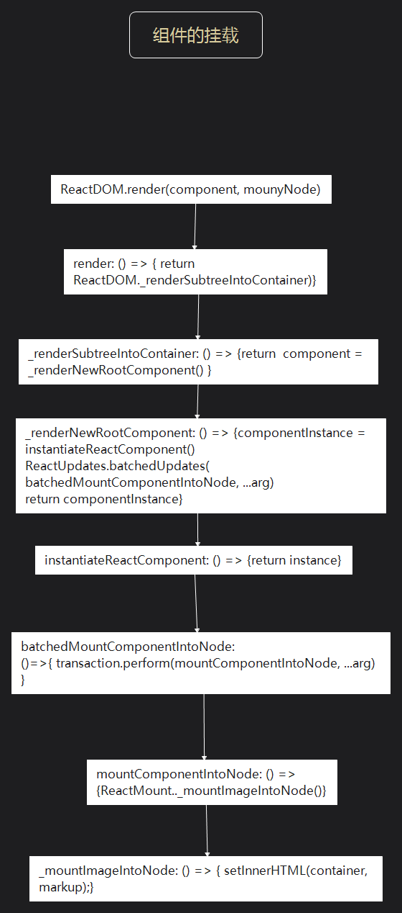

# React 源码解析之组件的实现与挂载

> 组件的构建和挂载

```
ReactDOM.render(<App />, document.getElementById('root'));
```

### 1、组件是什么

> Component 是一个类/函数？  
> 构建一个 Component 并打印

```
<B> <p>This is <strong>B</strong> component <p> </B>
```

  
组件 B 打印出来是一个对象，而组件中的`element` 都被包含在了 `children` 属性中，存储为一个 DOM 节点树

### 2、构建一个组件

> 文件路径：

- `ReactBaseClasses:`(react-15-stable/src/isomorphic/modern/class/ReactBaseClasses.js)
- `ReactElement:`(react-15-stable/src/isomorphic/classic/element/ReactElement.js)
- `ReactMount:` (react-15-stable/src/renderers/dom/client/ReactMount.js)  
- `ReactDOM:`(react-15-stable/src/renderers/dom/ReactDOM.js)

> `The Life-Cycle of a Composite Component`(react-15-stable/src/renderers/shared/stack/reconciler/ReactCompositionComponent.js)

在创建`ReactComponent`函数时，`ReactComponent`具有`props`、`context`、`refs`、`updater`等属性，以及`setState`、`forceUpdate`等方法  
在创建组件时，便可通过 class 类方法继承 ReactComponent 方法，并且使用其原型链上的方法

```
function ReactComponent(props, context, updater){
    this.props = props
    this.context = context
    this.refs = emptyObject
    this.updater = updater || ReactNoopUpdateQueue;
}
ReactComponent.prototype.isReactComponent = {}
ReactComponent.prototype.setState = function(partialState, callback){}
ReactComponent.prototype.forceUpdate = function(callback){}

module.exports = ReactComponent
```

当创建了组件 A 后，继承了 ReactComponent 方法，如果要将组件 A 渲染到 DOM 上，需通过 render()方法进行渲染。

```
class View extends React.Component{
    render () {
        return(
            <div className="wrapper--outer">
            <App />
            <div className="wrapper1--inner" style={{ color: "#38f" }}>
              hello world
            </div>
            <div className="wrapper2--inner">hello world</div>
          </div>
        )
    }
}
ReactDOM.render(<View />, document.getElementById("root"));
```

react 在渲染组件的时候会将其转化为 babel，babel 是在将 ES6 和 JSX 转化为 ES5 语句的工具，下列代码是上列代码通过 babel 转义过的代码，其中`_React$Component`是对象 Component，`_inherits`方法是`extends`关键字的函数实现，最主要的是在使用 render 方法，render 方法实际上是调用了 React.createElement 方法（实际是 ReactElement 方法）

```
var View = function (_React$Component) {
    _inherits(View, _React$Component);

    function View() {
        _classCallCheck(this, View);

        return _possibleConstructorReturn(this, (View.__proto__ || Object.getPrototypeOf(View)).apply(this, arguments));
    }

    _createClass(View, [{
        key: "render",
        value: function render() {
            return React.createElement(
                "div",
                { className: "wrapper--outer", __source: {
                        fileName: _jsxFileName,
                        lineNumber: 27
                    },
                    __self: this
                },
                React.createElement(__WEBPACK_IMPORTED_MODULE_0__App__["a" /* default */], {
                    __source: {
                        fileName: _jsxFileName,
                        lineNumber: 28
                    },
                    __self: this
                }),
                React.createElement(
                    "div",
                    { className: "wrapper1--inner", style: { color: "#38f" }, __source: {
                            fileName: _jsxFileName,
                            lineNumber: 29
                        },
                        __self: this
                    },
                    "hello world"
                ),
                React.createElement(
                    "div",
                    { className: "wrapper2--inner", __source: {
                            fileName: _jsxFileName,
                            lineNumber: 32
                        },
                        __self: this
                    },
                    "hello world"
                )
            );
        }
    }]);

    return View;
}(React.Component);

ReactDOM.render(React.createElement(View, {
    __source: {
        fileName: _jsxFileName,
        lineNumber: 38
    },
    __self: this
}), document.getElementById("root"));
```

React 在渲染组件时使用了 ReactElement 方法，该方法接收 7 个参数，在上图打印在控制台上的组件 B 里的对象中包含 element 的属性

- `$$typeof`:
  `Symbol(react.element)`此为组件的标识符， 此标签能让我们去识别这是一个 React 的 Element
- `type`、`key`、`ref`、`props`:这些都是 element 的属性，其中`key`是作为 DOM 结构标识，可提升 update 性能， `props`则记录子结构相关信息和组件属性， `ref`是对真实 DOM 的引用
- `_owner`：负责记录该组件创建的 element，当\_owner === ReactCurrentOwner.current 的值为创建当前组件的对象，默认值为 null

```
var ReactElement = function(type, key, ref, self, source, owner, props) {
  var element = {
    $$typeof: REACT_ELEMENT_TYPE,

    type: type,
    key: key,
    ref: ref,
    props: props,

    _owner: owner,
  };
  return element;
}
```

### 3、组件的挂载

在下列挂载组件的时候我们知道，组件的挂载使用过 ReactDOM 中的 render 方法进行挂载，而 render 接收两个参数，第一个就是我们创建的组件或者是原生的 DOM 或字符串，而另一个就是需要被挂载的 DOM 节点
`ReactDOM.render(component,mountNode)`

```
ReactDOM.render(<View />, document.getElementById("root"));
```

> `ReactDOM:`(react-15-stable/src/renders/dom/ReactDOM.js)
> `ReactMount:`(react-15-stable/src/renders/dom/client/ReactMount.js)

在 ReactDOM 中创建使用了`renderSubtreeIntoContainer`方法，该方法在 ReactMount 中被定义

```
var ReactDOM = {
  findDOMNode: findDOMNode,
  render: ReactMount.render,
  unmountComponentAtNode: ReactMount.unmountComponentAtNode,
  version: ReactVersion,

  /* eslint-disable camelcase */
  unstable_batchedUpdates: ReactUpdates.batchedUpdates,
  unstable_renderSubtreeIntoContainer: renderSubtreeIntoContainer,
  /* eslint-enable camelcase */
};
```

`renderSubtreeIntoContainer`主要就是渲染'子 DOM'到容器中，如果 React 组件先前被渲染到`container`，该函数就会直接对它执行更新，并且只在必要时改变 DOM 以反映最新的 React 组件

- `parentComponent`: 当前渲染组件的父组件
- `nextElement`: 要渲染的元素组件
- `container`: 要渲染的容器，如：document.getElementById('root')
- `callback`:完成后触发回调函数
  其流程大致为：`getTopLevelWrapperInContainer()`接收当前的容器`container`用来判断当前容器下是否存在组件，并赋值为`prevComponent`，如果当`prevComponent`为`true`时，便会执行`_updateRootComponent`进行更新，否则会执行`unmountComponentAtNode`将组件卸载

```
renderSubtreeIntoContainer: function(parentComponent,nextElement,container,callback,) {
    return ReactMount._renderSubtreeIntoContainer(
      parentComponent,
      nextElement,
      container,
      callback,
    );
},

_renderSubtreeIntoContainer: function(parentComponent, nextElement, container, callback){
var nextWrappedElement = React.createElement(TopLevelWrapper, {
      child: nextElement,
    });

    var nextContext;
    if (parentComponent) {
      var parentInst = ReactInstanceMap.get(parentComponent);
      nextContext = parentInst._processChildContext(parentInst._context);
    } else {
      nextContext = emptyObject;
    }

    var prevComponent = getTopLevelWrapperInContainer(container);

    if (prevComponent) {
      var prevWrappedElement = prevComponent._currentElement;
      var prevElement = prevWrappedElement.props.child;

      // 组件更新机制在生命周期部分解析
      if (shouldUpdateReactComponent(prevElement, nextElement)) {
        var publicInst = prevComponent._renderedComponent.getPublicInstance();
        var updatedCallback =
          callback &&
          function() {
            callback.call(publicInst);
          };
        ReactMount._updateRootComponent(
          prevComponent,
          nextWrappedElement,
          nextContext,
          container,
          updatedCallback,
        );
        return publicInst;
      }

      // 组件的卸载
      else {
        ReactMount.unmountComponentAtNode(container);
      }
    }

    var reactRootElement = getReactRootElementInContainer(container);
    var containerHasReactMarkup = reactRootElement && !!internalGetID(reactRootElement);
    var containerHasNonRootReactChild = hasNonRootReactChild(container);

    var shouldReuseMarkup =
      containerHasReactMarkup &&
      !prevComponent &&
      !containerHasNonRootReactChild;
    var component = ReactMount._renderNewRootComponent(
      nextWrappedElement,
      container,
      shouldReuseMarkup,
      nextContext,
    )._renderedComponent.getPublicInstance();
    if (callback) {
      callback.call(component);
    }
    return component;
}
```

这个方法是渲染一个新的组件到 DOM 节点上，通过钩子进行挂载，并且返回一个组件。

- `nextElement、container：`需要渲染的元素和容器
- `shouldReuseMarkup:`是否在插入的时候跳过标记

首先先通过`instantiateReactComponent`创建组件的实例,然后使用更新传递了`batchedMountComponentIntoNode`，`batchedMountComponentIntoNode`是以事务的形式调用`mountComponentIntoNode`,该方法返回组件对应的 HTML，并标记变量`markup`，而`mountComponentIntoNode`最终调用的是`_mountImageIntoNode`

```
  _renderNewRootComponent: function(nextElement,container,shouldReuseMarkup,context){
    var componentInstance = instantiateReactComponent(nextElement, false);
    ReactUpdates.batchedUpdates(batchedMountComponentIntoNode,componentInstance,container,shouldReuseMarkup,context);

    var wrapperID = componentInstance._instance.rootID;
    instancesByReactRootID[wrapperID] = componentInstance;

    return componentInstance;
  },
```

在`renderNewRootComponent`中通过`instantiateReactComponent`方法，接收一个当前需要渲染的节点，创建一个被挂载的实例，然后进行包装处理返回一个元素的构造函数的新实例。输入的`node`与输出的`instance`可以总结为下表  
| node | 实际参数 | instance |
| -- | -- | -- |
| `null/false` | 空 | 创建`ReactEmptyComponen`t 组件 |
| `object && type ===string` | React 组件| 创建`ReactCompositeComponent`组件 |
| `object && type !==string` | 虚拟DOM | 创建`ReactDOMComponent`组件 |
| `string` | 字符串 | 创建`ReactTextComponent`组件 |
| `number` | 数字| 创建`ReactTextComponent`组件|

```
function instantiateReactComponent(node, shouldHaveDebugID) {
  var instance;

  if (node === null || node === false) {
    instance = ReactEmptyComponent.create(instantiateReactComponent);
  } else if (typeof node === 'object') {
    var element = node;
    var type = element.type;

    if (typeof element.type === 'string') {
      instance = ReactHostComponent.createInternalComponent(element);
    } else if (isInternalComponentType(element.type)) {
      instance = new element.type(element);
      if (!instance.getHostNode) {
        instance.getHostNode = instance.getNativeNode;
      }
    } else {
      instance = new ReactCompositeComponentWrapper(element);
    }
  } else if (typeof node === 'string' || typeof node === 'number') {
    instance = ReactHostComponent.createInstanceForText(node);
  }

   return instance;
}
```

在上文已经提过，`batchedMountComponentIntoNode`是用来处理被挂载的容器和组件，然后调用`mountComponentIntoNode`方法，该方法会返回一个判断是否要挂载当前组件的标记——`markup`,然后调用`_mountImageIntoNode`,其核心代码是最后两行，`setInnerHTML`是一个将`markup`设置为`container`的`innerHTML`属性的方法，然后便可以完成DOM的插入，而`precacheNode`方法为了提高结构更新的速度，将处理好的组件对象存储在缓存中。  

```
function batchedMountComponentIntoNode(componentInstance,container,shouldReuseMarkup,context) {
  var transaction = ReactUpdates.ReactReconcileTransaction.getPooled(
    !shouldReuseMarkup && ReactDOMFeatureFlags.useCreateElement,
  );
  transaction.perform(
    mountComponentIntoNode,
    null,
    componentInstance,
    container,
    transaction,
    shouldReuseMarkup,
    context,
  );
  ReactUpdates.ReactReconcileTransaction.release(transaction);
}

function mountComponentIntoNode(wrapperInstance,container,transaction,shouldReuseMarkup,context,) {
  ReactMount._mountImageIntoNode(
    markup,
    container,
    wrapperInstance,
    shouldReuseMarkup,
    transaction,
  );
}

 _mountImageIntoNode: function(markup,container,instance,shouldReuseMarkup,transaction) {
     if (transaction.useCreateElement) {
      while (container.lastChild) {
        container.removeChild(container.lastChild);
      }
      DOMLazyTree.insertTreeBefore(container, markup, null);
    } else {
      setInnerHTML(container, markup);
      ReactDOMComponentTree.precacheNode(instance, container.firstChild);
    }
  }
```  

#### 挂载流程梳理总结   
- 根据`ReactDOM.render(component,mountNode)`传入的组件以及要挂载的容器的参数，通过`instantiateReactComponent`方法判断当前组件的类型并创建封装组件，然后标记为`componentInstance`  
- 然后将组件传递至`mountComponentIntoNode`方法中，通过`_mountImageIntoNode`方法获取到组件对应的HTML，并且标记变量`markup` 
- 最后将真实的DOM的属性 `innerHTML`设置为`markup`，便可以完成DOM插入    

  


###### 参考  
> [React源码解析(一):组件的实现与挂载](https://juejin.im/post/5983dfbcf265da3e2f7f32de)  
[React 源码分析(2)：组件的初始渲染](https://juejin.im/entry/5ae287fe518825673123ee01)
