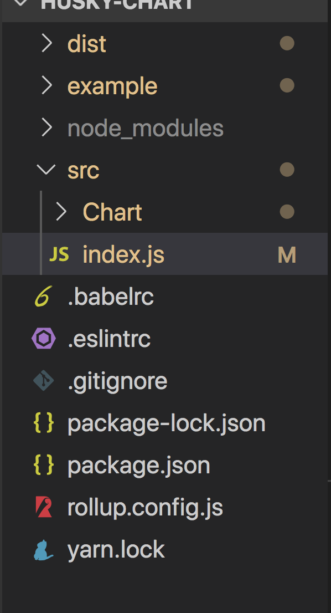
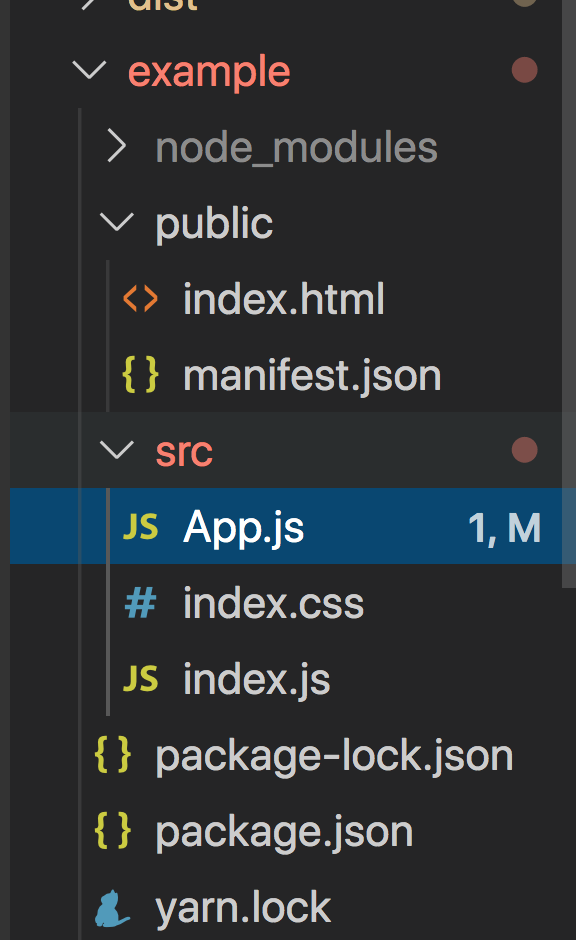
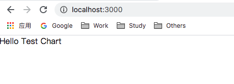

#创建React组件并发发布到npm  

### 基本步骤  
- 创建React组件项目  
- 创建example文件并引入组件进行测试  
- 发布React组件到npm  
  
#### 一、创建React组件项目  

- 基本项目文件如下
    
1、`yarn init`，`yarn add ...`等创建项目的依赖的基本信息    
对于yarn在安装插件的时候，可以对package.json的依赖分为 `dependencies`、`devDependencies` 
`dependencies`: 生产环境下使用该依赖，安装依赖时使用`--save`  
`devDependencies`: 开发环境下使用该依赖， 安装依赖时使用`--save-dev`  
```  
    {
    "name": "husky-chart",
    "version": "1.0.0",
    "description": "",
    "main": "dist/index.js",
    "module": "dist/index.es.js",
    "jsnext:main": "dist/index.es.js",
    "directories": {
        "example": "example"
    },
    "engines": {
        "node": ">=8",
        "npm": ">=5"
    },
    "scripts": {
        "test": "echo \"Error: no test specified\" && exit 1",
        "build": "rollup -c",
        "start": "rollup -c -w"
    },
    "repository": {
        "type": "git",
        "url": "git+https://github.com/husky0601/husky-chart.git"
    },
    "author": "",
    "license": "ISC",
    "bugs": {
        "url": "https://github.com/husky0601/husky-chart/issues"
    },
    "homepage": "https://github.com/husky0601/husky-chart#readme",
    "dependencies": {
        "loadsh": "0.0.4",
        "react": "^16.8.6"
    },
    "devDependencies": {
        "@babel/core": "^7.8.4",
        "@babel/preset-env": "^7.8.4",
        "@babel/preset-react": "^7.8.3",
        "@svgr/rollup": "^5.1.0",
        "babel-core": "^6.26.3",
        "babel-eslint": "^10.0.3",
        "babel-plugin-external-helpers": "^6.22.0",
        "babel-plugin-import": "^1.12.0",
        "babel-preset-env": "^1.7.0",
        "cross-env": "^7.0.0",
        "eslint": "^6.8.0",
        "eslint-config-standard": "^14.1.0",
        "eslint-config-standard-react": "^9.2.0",
        "eslint-plugin-import": "^2.20.1",
        "eslint-plugin-node": "^11.0.0",
        "eslint-plugin-promise": "^4.2.1",
        "eslint-plugin-react": "^7.18.3",
        "eslint-plugin-standard": "^4.0.1",
        "gh-pages": "^2.2.0",
        "node-sass": "^4.13.1",
        "react": "^16.12.0",
        "react-dom": "^16.12.0",
        "react-scripts": "^3.4.0",
        "rollup": "^1.31.1",
        "rollup-plugin-babel": "^4.3.3",
        "rollup-plugin-commonjs": "^10.1.0",
        "rollup-plugin-json": "^4.0.0",
        "rollup-plugin-node-resolve": "^5.2.0",
        "rollup-plugin-peer-deps-external": "^2.2.2",
        "rollup-plugin-postcss": "^2.0.6",
        "rollup-plugin-url": "^3.0.1"
    }
    }

```

2、配置打包模块的基本信息： 对于写UI组件的话，推荐使用rollup，该模块打包工具能够将所有的模块都打包在一起，并删除冗余代码，使打包后的文件体积尽可能的小。  
```
import babel from 'rollup-plugin-babel'
import commonjs from 'rollup-plugin-commonjs'
import external from 'rollup-plugin-peer-deps-external'
import postcss from 'rollup-plugin-postcss'
import resolve from 'rollup-plugin-node-resolve'
import url from 'rollup-plugin-url'
import svgr from '@svgr/rollup'
import json from 'rollup-plugin-json'

import pkg from './package.json'

export default {
    input: 'src/index.js',
    output:[
        {
            file: pkg.main,
            format: 'cjs',
            sourcemap: true
        },
        {
            file: pkg.module,
            format: 'es',
            sourcemap: true
        }
    ],
    external: ["react", "lodash"],
    experimentalCodeSplitting: true,
    plugins:[
        json({
            exclude: 'node_modules/**'
        }), 
        external(),
        postcss({
          modules: true
        }),
        url(),
        svgr(),
        babel({
            exclude: ['node_modules/**', '*.json'],
        }),
        resolve(),
        commonjs({
            include: ["node_modules/**"]
        })
    ]
}
```

3、创建我们的组件
```
// src/index.js 
import Chart from './Chart'
export default Chart

// src/Chart/index.js  
import React from 'react'

function Chart(){
    return <div>Hello Test Chart</div>
}

export default Chart
```    
4、打包组件  
```
yarn run build
```
5、将组件建立其测试连接  
```
yarn link
```

#### 二、创建example文件  
 
1、example 创建package.json文件   
```
{
  "name": "husky-chart-example",
  "version": "1.0.0",
  "description": "",
  "main": "index.js",
  "scripts": {
    "start": "react-scripts start",
    "build": "react-scripts build",
    "test": "react-scripts test --env=jsdom",
    "eject": "react-scripts eject"
  },
  "author": "husky",
  "license": "ISC",
  "dependencies": {
    "react": "^16.12.0",
    "react-dom": "^16.12.0",
    "react-scripts": "^3.4.0"
  },
  "browserslist": {
    "production": [
      ">0.2%",
      "not dead",
      "not op_mini all"
    ],
    "development": [
      "last 1 chrome version",
      "last 1 firefox version",
      "last 1 safari version"
    ]
  }
}
```  
2、引入组件  
```
// src/index.js  
import React from 'react'
import ReactDOM from 'react-dom'

import './index.css'
import App from './App'

ReactDOM.render( <App /> , document.getElementById('root'))  

// src/App.js  
import React from 'react';
import Chart from 'husky-chart'

function App () {
    return <div>
        <Chart />
    </div>
}
export default App 

// src/index.css
body {
    margin: 0;
    padding: 0;
    font-family: sans-serif;
}

```  
3、连接测试文件  
```
yarn link "husky-chart"
```  
4、启动测试文件  
```
yarn start
```
   

#### 三、部署项目到npm  
1、首先需要有npm的账号，如果没有到[npm官网进行注册](https://www.npmjs.com/)  
2、在项目中登陆我们的npm账号： `yarn login`,过程中可能需要我们验证邮箱。 
3、`yarn publish`
