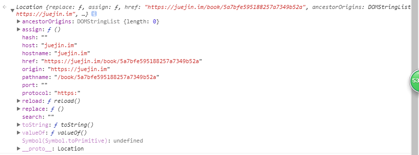
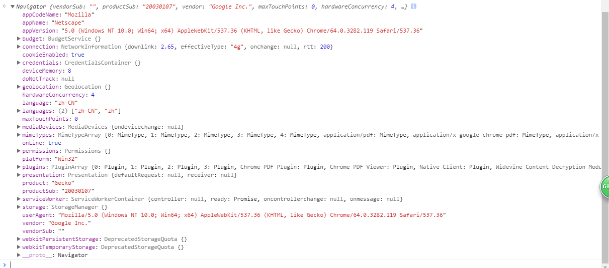
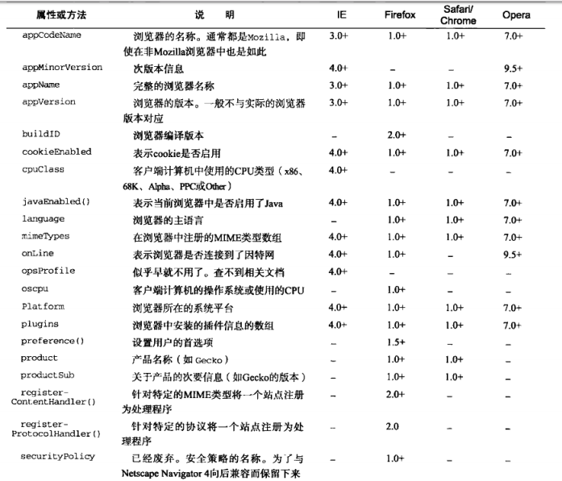
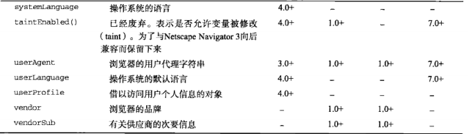
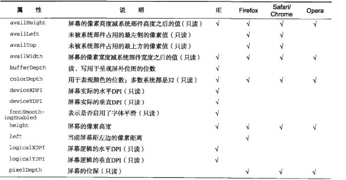
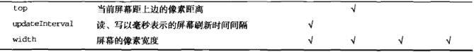

# 浏览器对象模型  
## 一、WHAT  
- `BOM` ：`Browser Object Model`（浏览器对象模型）,浏览器模型提供了独立于内容的、可以与浏览器窗口进行滑动的对象结构，就是浏览器提供的API  
- 其主要对象有：  
    1、window对象——BOM的核心，是js访问浏览器的接口，也是ES规定的Global对象  
    2、location对象：提供当前窗口中的加载的文档有关的信息和一些导航功能。既是window对象属  性，也是document的对象属性  
    3、navigation对象：获取浏览器的系统信息  
    4、screen对象：用来表示浏览器窗口外部的显示器的信息等  
    5、hitory对象：保存用户上网的历史信息    

## Window对象   
>windows对象是整个浏览器对象模型的核心，其扮演着既是接口又是全局对象的角色

## Location对象  

> 提供当前窗口中的加载的文档有关的信息和一些导航功能。既是window对象属性，也是document的对象属性    
```
window.location === document.location  //true
```
> location还将url解析为独立的片段，可通过location的属性来访问不同的片段    
- location对象的主要属性：   
  


| 属性名 | 例子 | 说明 |
| -- | -- | -- |
| `hash`| " #host " | 返回url中的hash（#后字符>=0） 
| `host` | " juejin.im:80 " | 服务器名称+端口（如果有）
|`hostname` | " juejin.im " | 只含服务器名称 
| `href` | " https://juejin.im/book/5a7bfe595188257a7349b52a " | 当前加载页面的完整的url
| `pathname` | " /book/5a7bfe595188257a7349b52a " | 返回url的的目录和（或）文件名
| `port` | " 8080 " | url的端口号，如果不存在则返回空
| `protocol` | " https: (or http:) " | 页面使用的协议 
|`search` | " ?name=aha&age=20 " | 返回url的查询字符串， 以问号开头    


- location的应用场景：  
    1、解析url查询字符串参数，并将其返回一个对象，可通过循环、正则来实现，方法有很多,实现的大体思路是：  
    通过`location`的`search`属性来获取当前url传递的参数，如果url中有查询字符串的话就将其问号截取掉，然后再遍历里面的字符串并以等号为断点，使用`decodeURIComponent()`方法来解析其参数的具体数值，并将其放在对象容器中，并将其返回  
    2、载入新的文档，也可以说是刷新页面，主要有三个方法：  
    * **`assign()`：**  location.assign("http://www.xxx.com")就可立即打开新url并在浏览器是我历史中生成一条新的记录, 在一个生成了5条浏览记录的页面中，然后使用assign()跳转url后，history记录只剩两条，一条是通过assign跳转的页面，另一条则是上一个页面（使用assign()跳转方法的页面），其余的所有页面都被清除掉了
    * **`replace()`:** location.replace("http://www.bbb.com")只接受url一个参数，通过跳转到的url界面不会在浏览器中生成历史记录，就是history的length不会+1，但是会替代掉当前的页面
    * **`reload()`:** 其作用是重新加载当前显示的页面，当不传递参数的时候，如果页面自上次请求以来并没有改变过，页面就会从浏览器中重新加载，如果传递`true`，则会强制从服务器重新加载


## Navigation对象   
> navigation接口表示用户代理的状态和标识，允许脚本查询它和注册自己进行一些活动 
- navigation对象的属性方法  
  
  
   

- navigation应用场景    
  * 检测插件  
  * 注册处理程序 

## Screen对象   
> 其提供有关窗口显示的大小和可用的颜色输入信息。 
- screen对象的属性和方法
   
   

## History对象
