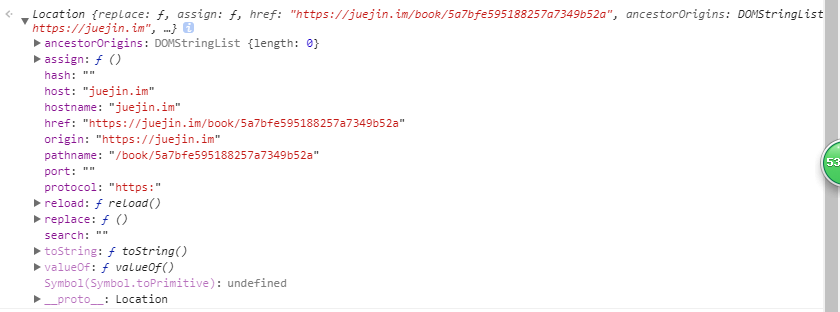
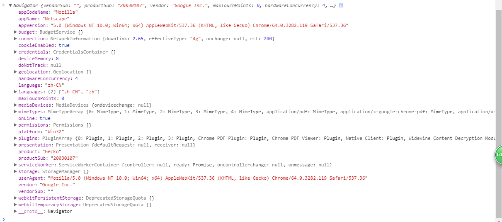
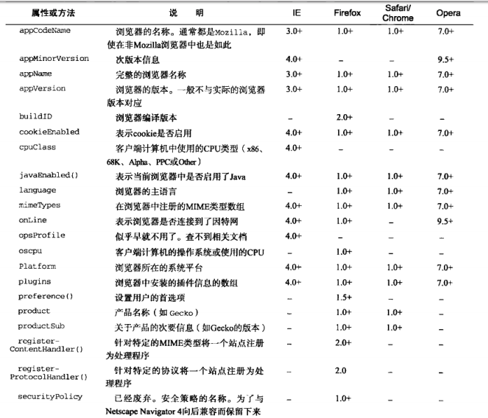
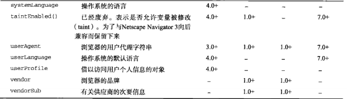
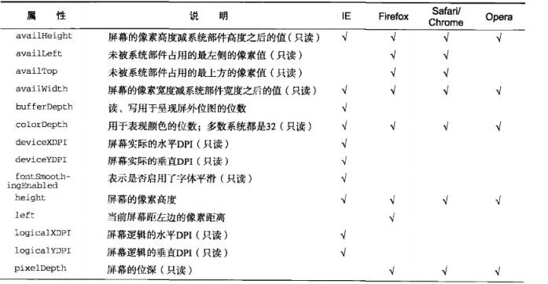
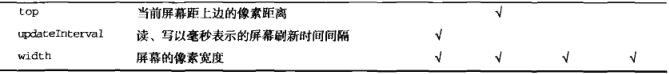

# 浏览器对象模型

## 一、WHAT

* `BOM` ：`Browser Object Model`（浏览器对象模型）,浏览器模型提供了独立于内容的、可以与浏览器窗口进行滑动的对象结构，就是浏览器提供的 API
* 其主要对象有：  
   1、window 对象——BOM 的核心，是 js 访问浏览器的接口，也是 ES 规定的 Global 对象  
   2、location 对象：提供当前窗口中的加载的文档有关的信息和一些导航功能。既是 window 对象属 性，也是 document 的对象属性  
   3、navigation 对象：获取浏览器的系统信息  
   4、screen 对象：用来表示浏览器窗口外部的显示器的信息等  
   5、hitory 对象：保存用户上网的历史信息

## Window 对象

> windows 对象是整个浏览器对象模型的核心，其扮演着既是接口又是全局对象的角色

* window 对象的属性和方法

| 属性            | 说明                                                                                                                                                                                                                     |
| --------------- | ------------------------------------------------------------------------------------------------------------------------------------------------------------------------------------------------------------------------ |
| `alert()`       | 系统警告对话框，接收字符串参数并显示                                                                                                                                                                                     |
| `confirm()`     | 系统确认对话框，可提供确认或取消两种事件                                                                                                                                                                                 |
| `prompt()`      | 提示对话框，可对用户展示确认、取消事件外，还可提供文本域                                                                                                                                                                 |
| `open()`        | 可导航至特定的 url，又可打开一个新的浏览器窗口</br>`window.open(要加载的url, 窗口目标, 一个特定字符串, 一个新页面是否取代浏览器历史记录中当前加载页面的布尔值)`                                                          |
| `onerror()`     | 事件处理程序，当未捕获的异常传播到调用栈上时就会调用它，并把错误消息输出到浏览器的 JavaScript 控制上。</br>`window.onerror(描述错误的一条消息, 字符串--存放引发错误的JavaScript代码所在的文档url, 文档中发生错误的行数)` |
| `setTimeout()`  | 超时调用——在指定的时间过后执行代码</br>`window.setTimeout(function(){...}, 毫秒)`                                                                                                                                        |
| `setInterval()` | 间歇调用——每隔指定的时间就执行一次</br>`window.setInterval(function(){...}, 毫秒)`                                                                                                                                       |

* 应用场景应用场景：  
   **1、确认窗口位置及大小**   
   获取窗口位置的属性与方法   

| 属性  | 说明  | 兼容性
|---|---|---|
| `screenLeft`  | 窗口相对于屏幕`左边`的位置  | 适用于IE、Safari、Chrome
| `screenTop`  | 窗口相对于屏幕`上边`的位置  | 适用于IE、Safari、Chrome
| `screenX`  | 窗口相对于屏幕`左边`的位置  | 适用于Firefox
| `screenY`  | 窗口相对于屏幕`上边`的位置  | 适用于Firefox 
| `moveBy(x,y)` | 接收的是在水平和垂直方向上移动的像素数 | 全兼容 
| `moveTo(x,y)` | 接收的是新位置的x和y坐标值 | 全兼容

跨浏览器获取窗口左边和上边位置   
```
var leftPos = (typeof window.screenLeft == 'number') ? window.screenLeft : window.screenX

var topPos = (typeof window.screenTop == 'number') ? window.screenTop : window.screenY  
```  
窗口大小属性与方法   
| 属性  | 说明   |
|---|---|
| `innerWidth` <br> `innerHeight`  | **IE9+、Safari、Firefox、Opera:** 该容器中页面视图区的大小 <br> **Chrome:** 返回视口大小 <br> **移动设备：** 返回可见视口（即屏幕上可见页面区域的大小） <br> **移动IE浏览器：** 不支持该属性,当移动IE浏览器将布局视口的信息保存至`document.body.clientWidth`与`document.body.clientHeight`中 |
| `outerWidth` <br> `outerHeight` | **IE9+、Safari、Firefox:** 返回浏览器窗口本身的尺寸<br>  **Opera:**  返回页面视图容器的大小 <br> **Chrome:** 返回视口大小
| `resizeTo(width, height)`| 接收浏览器窗口的新宽度与新高度
| `resizeBy(width, height)`| 接收新窗口与原窗口的宽度与高度之差

   **2、导航和打开窗口**   
| 属性  | 说明  |
|---|---|
| `open(url,[target,string,boolean])`  | **url:** 要加载的URL，<br> **target:** 窗口目标  <br> **string:** 特定的字符串，以逗号分隔的字符串表示新窗口显示的特性<br> **boolean:** 表示新页面是否取代浏览器历史记录中当前加载页面的布尔值  |
- `open()` 方法，创建一个新的浏览器窗口对象，如同使用文件菜单中的新窗口命令一样。url 参数指定了该窗口将会打开的地址。如果url 是一个空值，那么打开的窗口将会是带有默认工具栏的空白窗口（加载`about:blank`）  
- 调用`window.open()`方法以后，远程 URL 不会被立即载入，载入过程是异步的。（实际加载这个URL的时间推迟到当前脚本块执行结束之后。窗口的创建和相关资源的加载异步地进行。)，这会导致使用open方法时会被作为广告而被浏览器拦截。


   **3、定时器**  
   `setTimeout()`与`setInterval()`都是由于 JavaScript 的语言特性所产生的，由于 JavaScript 是一个单线程的解释器，因此一定时间内只能执行一段代码，为了控制要执行的代码，便有了一个 JavaScript 队列。这些任务会按照将他们添加到队列的顺序执行。`setTimeout()`和`setInterval()`的第二个参数会告诉 JavaScript 再过多长时间把当前任务添加到队列中。如果队列是空的，那么添加的代码会立即执行；如果队列不是空的，那么它就要等前面的代码执行完了之后再执行。  
   两者在被调用之后，都会返回一个数值 ID，这个 ID 可以用来取消对该方法的调用  
   **下面是一段倒计时的代码**  
   ```javascript {cmd="node"}
    <!-- 使用setInterval()来执行倒计时 -->
    var num = 10 
    var interval = setInterval(function(){ 
        num -- 
        console.log(num)
        if(num == 0) { 
            clearInterval(interval) 
            console.log('Done') 
        } 
    }, 1000)  


    <!-- 使用setTimeout()来执行倒计时 -->
    var num = 10
    var timeout = function(){
        num--
        console.log(num)
        if(num > 0){
            setTimeout(timeout, 1000)
        }else {
            console.log('Done')
        }
    }
    setTimeout(timeout,1000)
    ```  
    上面使用两种方法都可以进行倒计时，但是使用 `setInterval()` 方法的时候，再不加干涉的情况下，该方法会一直执行到页面的卸载，所以一般情况下`serInterval()`比较消耗性能。然后`setTimeout()`方法可以通过调用自身完成间歇调用的功能。所以说，在一般情况下使用`setTimeout()`来完成超时与间歇调用。

## Location 对象

> 提供当前窗口中的加载的文档有关的信息和一些导航功能。既是 window 对象属性，也是 document 的对象属性

```
window.location === document.location  //true
```

> location 还将 url 解析为独立的片段，可通过 location 的属性来访问不同的片段

* location 对象的主要属性：



| 属性名     | 例子                                                | 说明                               |
| ---------- | --------------------------------------------------- | ---------------------------------- |
| `hash`     | " #host "                                           | 返回 url 中的 hash（#后字符>=0）   |
| `host`     | " juejin.im:80 "                                    | 服务器名称+端口（如果有）          |
| `hostname` | " juejin.im "                                       | 只含服务器名称                     |
| `href`     | " https://juejin.im/book/5a7bfe595188257a7349b52a " | 当前加载页面的完整的 url           |
| `pathname` | " /book/5a7bfe595188257a7349b52a "                  | 返回 url 的的目录和（或）文件名    |
| `port`     | " 8080 "                                            | url 的端口号，如果不存在则返回空   |
| `protocol` | " https: (or http:) "                               | 页面使用的协议                     |
| `search`   | " ?name=aha&age=20 "                                | 返回 url 的查询字符串， 以问号开头 |

* location 的应用场景：  
   1、解析 url 查询字符串参数，并将其返回一个对象，可通过循环、正则来实现，方法有很多,实现的大体思路是：  
   通过`location`的`search`属性来获取当前 url 传递的参数，如果 url 中有查询字符串的话就将其问号截取掉，然后再遍历里面的字符串并以等号为断点，使用`decodeURIComponent()`方法来解析其参数的具体数值，并将其放在对象容器中，并将其返回  
   2、载入新的文档，也可以说是刷新页面，主要有三个方法：
  * **`assign()`：** location.assign("http://www.xxx.com")就可立即打开新 url 并在浏览器是我历史中生成一条新的记录, 在一个生成了 5 条浏览记录的页面中，然后使用 assign()跳转 url 后，history 记录只剩两条，一条是通过 assign 跳转的页面，另一条则是上一个页面（使用 assign()跳转方法的页面），其余的所有页面都被清除掉了
  * **`replace()`:** location.replace("http://www.bbb.com")只接受 url 一个参数，通过跳转到的 url 界面不会在浏览器中生成历史记录，就是 history 的 length 不会+1，但是会替代掉当前的页面
  * **`reload()`:** 其作用是重新加载当前显示的页面，当不传递参数的时候，如果页面自上次请求以来并没有改变过，页面就会从浏览器中重新加载，如果传递`true`，则会强制从服务器重新加载

## Navigation 对象

> navigation 接口表示用户代理的状态和标识，允许脚本查询它和注册自己进行一些活动

* navigation 对象的属性方法  
    
    
  

* navigation 应用场景
  * 检测插件
  * 注册处理程序

## Screen 对象

> 其提供有关窗口显示的大小和可用的颜色输入信息。

* screen 对象的属性和方法
    
  

## History 对象

> history 对象保存着用户上网的历史记录，从窗口被打开的那一刻算起，history 对象是用窗口的浏览历史用文档和文档状态列表的形式表示。history 对象的 length 属性表示浏览历史列表中的元素数量，但出于安全考虑，脚本不能访问已保存的 url

* History 对象的属性及方法

| 属性        | 说明                                                                                                                                                                                                  |
| ----------- | ----------------------------------------------------------------------------------------------------------------------------------------------------------------------------------------------------- |
| `go()`      | 1、以在用户的历史记录中任意跳转，`go(n)`表示前进 n 页， `go(-n)`表示后退 n 页(n>0) </br> 2、`go()`可以传递字符串参数，浏览器历史中如果有这条 url 则实现跳转至包含该字符串的第一个位置，否则什么也不做 |
| `back()`    | 后退一页                                                                                                                                                                                              |
| `forword()` | 前进一页                                                                                                                                                                                              |
| length      | 保存历史记录的数量，可用于检测当前页面是否是用户历史记录的第一页`（history.length === 0）`                                                                                                            |
