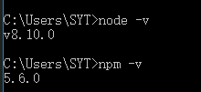
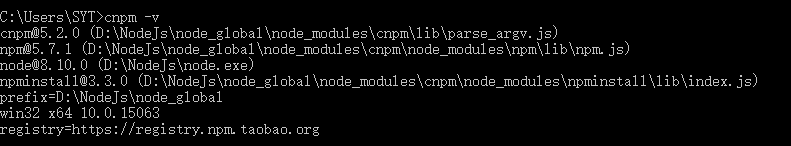

# NODE安装与配置  

### 1、下载node  
首先需要到[nodejs官网](https://nodejs.org/zh-cn/download/releases/)上下载相对应的版本，本机配置的windows 10的node，选择`.msi`后缀的安装包，下载完后就可以直接安装  
下载安装完后打开cmd控制命令面板，查看node与npm版本号
```
//node
node -v

// npm
npm -v
``` 
   
一般安装完node，在系统变量中就会自动配置node的存放路径  

### 2、更改全局模块存放路径  
更改全局模块存放路径，可以指定当全局安装某些插件的时候，安装的模块就会被安装在指定的路径下，例如本人在NodeJs下建立`node_global`和`node_cache`两个文件夹，然后执行命令：   
```
npm config set profix "D:/NodeJs/node_global"

npm config set cache "D:/NodeJs/node_cache"
```  

### 3、安装cnpm  
由于国内网络限制，使用npm安装模块的时候非常慢，所以可以使用淘宝镜像来加快下载所需的模块  
```
npm install -g cnpm --registry=https://registry.npm.taobao.org
```  
安装完了之后，查看cnpm版本的时候，发现cmd提示cnmp不是内部或外部的指令，这就需要给cnpm配置环境，右击电脑`属性 -> 高级系统设置 -> 环境变量 -> 系统变量中的Path` 进行编辑，之前更改了全局模块安装路径，当全局安装模块的时候，文件就会自动存储在`node_global`文件中，所以在系统变量中增加`D:\NodeJs\node_global`的`Path`配置，然后重新打开cmd，`cnpm -v`
  

### 4、全局安装模块  
