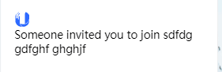
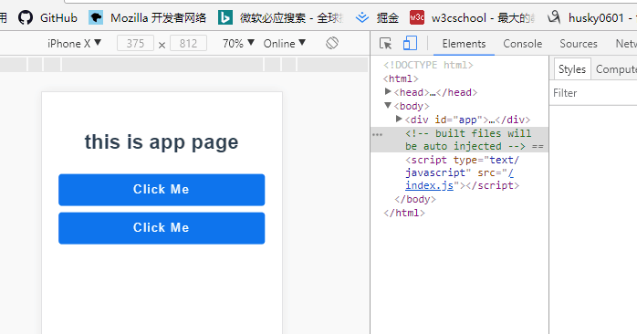

# 错误集   

# 2018.03.16  
### 1、  
```
Module build failed: ModuleBuildError: Module build failed: Error: No PostCSS Config found in: /Users/ut2017/Desktop/workspace/vue-learning/UUM-www/src/sass
```
npm run build 的时候出现：说是没有配置PostCss  
PostCSS: 是一个基于js插件的转换样式的工具  
那么也就是说，sass是一个css的预处理器，要将sass转化为css，
>需要了解webpack的解析原理，以及浏览器是如何将样式解析并加载到浏览器的页面上的  

### 2、babel-loader错误  
- 首先得先了解一下这个插件的作用，以及`.babelrc`文件的作用  

### 3、  
- 在vue的多页面中，安装完ui组件框架之后，通过按需加载组件的方式引入组件时，`mint-ui`组件中无法使用`@import`导入样式, `element-ui`导入模块后无法使用该函数，在`scss`文件中，引用`assets`中的`imgs`图片无法使用  

### 4、在多页面中如何使用全局样式  
在`.vue`文件中使用:  
全局：`<style lang="scss" src='../../sass/index.scss'></style>`   
局部：`<style lang="scss" scoped src="./invite.scss"></style>` 
- **scoped：** 是一个局部作用域，意思是当前的样式只对该组件起作用，通过`PostCSS`来实现转化，在浏览器中，定义的`class`名称被转化为`.xxx[data-v-随机数]`  
-   

### 5、背景图片占满整个视口
- 通过在body中使用background属性，并通过调整图片的位置、是否平铺等属性来实现   
```
body{
    background: url("../../assets/imgs/bitmap@2x.png") fixed center center no-repeat;
    background-size: cover;
}
```
- 通过使用固定定位来使背景图片定死，即将图片的各个位置与浏览器的四个边角对其。  
```
.invite{
    width: 100%;
    position: fixed;
    top: 0;
    left: 0;
    bottom: 0;
    right: 0;
    background: url("../../assets/imgs/bitmap@2x.png") fixed center center no-repeat;
    background-size: cover;
}
```     
定死4个边角之后，一旦显示的内容高度增加，永远只显示出浏览器视口的高度，无法对页面进行滚动。试了一圈之后，只能将图片的位置改为absolute，不能使用fiexed，这会固定在当前视口的宽度和高度上，但是使用absolute需要使用具体的高度，否则图片无法显示。

`CSS`的`background`属性：参见[background](https://developer.mozilla.org/zh-CN/docs/Web/CSS/background)  

# 2018.03.18  
### 1、图片与文字  
图片与文字是在同一行里面，外层是由一个p标签将其包裹，图片设置大小，并将其设置为居中，文字是以span标签显示，但是当span中的文字超出一行的时候，文字变成一个块级元素（浮动元素会自动变成块级元素），然后从下一行开始显示，如图所示：  
  
一开始是将图片和文字都设置为左浮动，并且设置文字和图片的宽度，这两个元素的宽度超过父级元素的宽度，span标签内的元素就自动转化块级元素，并且从另一方开始。之后在子元素使用`disply:inline-block`属性，然后在父级元素定义`text-aglin:left`让父元素内的所有子元素都向左对齐，这样的话，确实能够将图片与文字分段显示，但是图片与文字的无法很好的在并排在一起。后来想了一下项目的需求，这一行文字的内容不是很多，一般一行就够了，等到时候如果超出了再想办法。然后看到了有关`inline-block`（内联块）的文章，挺实用的，记录一下[w3cschool](https://www.w3cschool.cn/css/css-layout.html)、[基于display:inline-block的列表布局](http://www.zhangxinxu.com/wordpress/2010/11/%E6%8B%9C%E6%8B%9C%E4%BA%86%E6%B5%AE%E5%8A%A8%E5%B8%83%E5%B1%80-%E5%9F%BA%E4%BA%8Edisplayinline-block%E7%9A%84%E5%88%97%E8%A1%A8%E5%B8%83%E5%B1%80/)   
### 2、谷歌中的模拟的移动端与真实的移动端按钮的背景颜色和圆角不一样。   
- 原因是使用的标签元素不一样，导致展现的效果不同，一开始使用按钮的标签`<input type='button' />`然后在手机上展示出来的和控制台上的不一样，后面使用`<button></button>`就可以了  
```
input[type=button], button {
  color: #fff;
  cursor: default;
  padding: 0 10px;
  border: 0;
  letter-spacing: 0.1em;
  height: 50px;
  width: 90%;
  font-size: 1.2em;
  margin-top: 10px;
  line-height: 50px;
  border-radius: 5px;
  background-color: #0f75ed;
}
```  
设置两个相同样式的input标签和botton标签的样式，在真机和模拟机上显示出来的完全不一样    
在移动端上的：  
      
在控制台上的： 
    
这真的就得很需要理解web语义化的含义了，不同的标签都有其功能意义，还有其属性特质，展现出来的效果也不一样。  
  

# 2018.03.19  
### 1、弹框无法如预期的展现    
在家里测试的时候还好好的，但是在公司里测试的时候出现了问题：   
- 使用`<input type=email />`标签时，没有是有required属性，点击提交的时候仍然会提示邮箱格式不正确，此时toast弹框可以正常显示，如果将input的type改为text，则不会显示默认的必填样式，且toast无法显示 
- 点击提交后，页面自动刷新，页面地址后面出现了个`❓`，而且弹框无法显示   

✅ 经过分析找到原因：    

在`form`表单中的 `<button>` 标签默认的`type`是`submit`属性，而`submit`的首先会验证`input`框中的属性格式是否书写正确，如果不正确会有默认的提示，然后验证完后会自动跳转页面。将`button`中的`type`属性改为`button`就可以了，除此之外，在form表单中button还有一个`重置`的`type`，这个也是在表单中才可以使用。